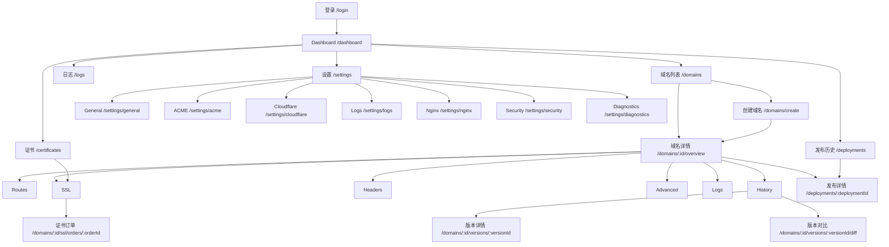

# Nginx Domain Manager 产品需求文档

> 版本：v1.9
>
> 状态：评审修订完成
>
> 更新日期：2026-07-18
> 关联文档：[技术设计](./TECHNICAL_DESIGN.md)

## 1. 文档目的

本文定义 Nginx Domain Manager MVP 的产品范围、信息架构、页面交互、页面跳转、业务规则和验收标准，供产品、设计、前端、后端和测试共同使用。

## 2. 产品定义

### 2.1 产品定位

Nginx Domain Manager 是一个基于“域名”模型的可视化 Nginx 配置管理平台。管理员不必直接编辑 Nginx 配置文件，即可完成反向代理、静态目录、重定向、HTTPS、Let's Encrypt 自动续期、版本比较、安全发布和回滚。

### 2.2 要解决的问题

- 手写 Nginx 配置学习成本高，语法错误容易导致服务不可用。
- 多域名配置、证书和发布记录分散，缺少统一视图。
- 配置变更通常直接覆盖线上文件，缺少测试、审计和回滚能力。
- Let's Encrypt 申请和续期依赖人工脚本，失败不易发现。
- 操作结果只有命令行输出，非专业用户无法快速判断当前状态。

### 2.3 产品目标

- 以域名为中心管理站点及其路由、请求头、HTTPS 和高级配置。
- 每次业务配置变更都形成不可变版本，发布行为可追溯。
- 发布前生成完整候选配置并执行 `nginx -t`，失败时不影响线上配置。
- 支持安全 reload 和一键回滚，避免直接重启造成连接中断。
- 自动申请/续期 Let's Encrypt 证书，并在签发闭环结束后通过独立配置版本和发布单启用证书。
- 在一个 Docker 镜像中交付 Web、API/部署 Worker 和 Nginx，降低部署门槛。

### 2.4 成功指标

MVP 上线后通过以下指标判断有效性：

| 指标 | 目标 |
| --- | --- |
| 域名从创建到首次代理发布 | 5 分钟内完成 |
| 配置语法错误进入线上 | 0 次 |
| 发布/回滚操作可审计率 | 100% |
| 已开启自动续期的证书在到期前 30 天进入续期流程 | 100% |
| 常规发布导致的已有连接中断 | 0 次（使用 graceful reload） |

## 3. 用户与使用场景

### 3.1 MVP 用户

MVP 仅包含一个角色：管理员。管理员能够查看、创建、修改、发布、回滚域名配置，管理证书和系统设置。多用户、细粒度 RBAC 和审批流不在 MVP 范围内。

### 3.2 典型场景

1. 将 `example.com` 的 `/api` 代理到容器网络中的 `http://app:3000`。
2. 将 `www.example.com` 永久重定向到 `https://example.com`。
3. 为域名申请 Let's Encrypt 证书并开启 HTTP 强制跳转 HTTPS。
4. 修改 upstream 后先查看差异，再测试并发布新版本。
5. 发布异常时从历史版本发起回滚，恢复已知可用配置。
6. 在 Dashboard 发现证书即将过期并手动触发续期。
7. 按域名查看 Nginx access/error log，过滤异常请求并实时跟踪新日志。

## 4. 范围与边界

### 4.1 MVP 范围

- Dashboard 运行状态与待处理事项。
- 域名的创建、查询、编辑、启停和删除。
- Reverse Proxy、Static Website、Redirect 三类路由。
- WebSocket、代理超时和基础 Header 配置。
- Let's Encrypt HTTP-01、DNS-01 手动验证、DNS-01 Cloudflare 自动验证、手动续期、自动续期和强制 HTTPS。
- Settings 管理多个命名 Cloudflare API Token，证书申请时选择并校验其 Zone 访问能力。
- JSON 配置快照、Nginx 配置生成、语法测试、发布历史、版本差异和回滚。
- 按域名分目录保存 Nginx access/error log，支持分行读取、过滤、实时跟踪和日志轮动。
- 全局配置 access log 字段、error log level、单文件大小和保留文件数量，并自动注入所有域名配置。
- SQLite 单机持久化。
- 单 Docker 镜像部署，Worker 在容器内控制本机 Nginx。
- 单管理员登录和会话退出。

### 4.2 非目标

- 集群、多 Nginx 节点下发和高可用控制平面。
- Kubernetes Ingress、远程 SSH 节点或云负载均衡器管理。
- 多租户、审批流、RBAC、SSO 和开放注册。
- 任意完整 Nginx 配置文件编辑器。
- 通配符证书、Cloudflare 以外的自动 DNS Provider 和商业 CA。
- WAF、长期流量统计、日志聚合检索平台和告警通知渠道。
- 自动发现 Docker 容器或服务。

### 4.3 产品假设

- 一个运行实例只控制同一容器内的一个 Nginx。
- 生产部署必须通过环境变量提供唯一 `MANAGER_URL=https://<manager-host>`，并挂载管理端 TLS 证书/私钥；管理端主机名由系统保留，不能创建为用户 Domain 或 Alias。
- 生产部署必须通过环境变量 `NGINX_LOG_DIR` 指定统一的 Nginx 日志根目录，并把该绝对路径挂载到持久卷；产品不在 SQLite 保存域名日志目录。
- 管理端证书由部署方在产品外签发/续期并挂载，MVP 不使用自身 ACME Domain 模型管理管理端证书，避免自举循环。
- 使用 HTTP-01 时，80 端口可从公网访问且 challenge 请求可到达该容器；使用 DNS-01 时不依赖入站 80 端口。
- 用户自行保证域名 DNS 已指向部署主机。
- Worker 可以出站访问 ACME CA、DNS resolver；Cloudflare 模式还需访问 Cloudflare API。若环境禁止 UDP/TCP 53，应配置受支持的 DNS-over-HTTPS resolver。
- 代理目标必须能从容器网络访问；宿主机服务使用平台支持的 host gateway 地址。
- SQLite、证书、配置版本和 Nginx 日志目录均挂载持久卷。

## 5. 核心领域模型

### 5.1 Domain

Domain 是核心业务对象，包含：

- 主域名，例如 `example.com`。
- 可选别名，例如 `www.example.com`。
- 启用状态和运行状态。
- Routes、Headers、SSL 和 Advanced Snippet。
- 草稿版本、当前发布版本和历史版本。

### 5.2 Config Version

- 保存一次完整、不可变的 Domain JSON 快照。
- 版本号在域名内单调递增，如 v1、v2。
- 编辑保存产生新草稿，不直接改变线上配置。
- 发布成功后该版本成为当前发布版本。
- 回滚不重新激活旧记录，而是复制旧快照形成一个新版本再发布，确保审计链只增不改。

### 5.3 Deployment

Deployment 记录一次配置测试、发布、回滚、启停/移除域名、全局日志应用、运行时重建或管理证书 reload，包含步骤、状态、日志摘要、目标版本、起止时间和失败原因。证书申请本身由 ACME Order 记录，不属于 Deployment。

### 5.4 Certificate

Certificate 是已下载并校验的不可变证书资产，记录 Domain、来源 ACME Order、SAN、文件路径和状态。`Ready` 表示已签发但尚未发布，`Active` 表示当前线上配置正在引用，`Superseded` 表示已被新证书替换。一个 Domain 可以保留多个 Certificate；私钥不通过 UI 或普通 API 返回。

### 5.5 Log Settings

Log Settings 是实例级配置，定义 access log 的结构化字段、error log level、单文件大小上限和保留文件数量。它不属于某个 Domain 版本；保存后创建全局配置任务，将同一日志策略注入所有已发布 Domain（包括 Disabled）并安全 reload。每个域名的日志内容保存在以规范化主域名命名的独立目录中。

### 5.6 ACME Order 与 Challenge

- ACME Order 记录一次证书申请/续期及其全部域名授权，状态可在容器重启后恢复。Order 的业务闭环止于证书下载并创建 `Ready` Certificate，不包含 Config Version 发布结果。
- HTTP Challenge token 作为与 Domain 关联的临时记录保存；公网 well-known 接口按请求 Host + token 查询并返回 `keyAuthorization`。
- DNS Challenge 保存 `_acme-challenge` TXT 名称和值。手动模式等待用户配置；Cloudflare 模式保存本次创建的 Zone/Record ID 以便精确清理。
- Challenge 成功、失败、取消或过期后清理临时 HTTP token；Cloudflare TXT 只删除本订单创建的记录。
- Order 成功后由独立激活编排依次创建新 Config Version 和 Deployment；任一下游步骤失败都不改变 Order=`Succeeded` 或 Certificate=`Ready`。

### 5.7 Cloudflare Credential

Cloudflare Credential 是实例级命名凭据，包含唯一名称、加密 token、验证状态、最近验证时间和 token 元数据。管理员可配置多个；Token 创建后不再回显，只允许替换。证书申请选择 Cloudflare 时必须指定一个凭据，并确认该凭据可访问证书全部 hostname 对应的 Zone。

### 5.8 Certificate Activation

Certificate Activation 是 Ready Certificate 到线上配置的独立下游对象，状态和错误不属于 ACME Order。它先创建引用 Certificate ID 的 Config Version，再以该 Version 创建 Deployment；通过 Certificate ID、Version 来源字段和 Deployment 幂等键保证重试不重复创建。

## 6. 信息架构与全局布局

### 6.1 页面地图



### 6.2 全局导航

桌面端左侧 Sidebar 固定展示：

1. Dashboard
2. Domains
3. Certificates
4. Deployments
5. Logs
6. Settings

底部展示当前 Nginx 状态、管理员菜单和退出入口。折叠状态保留图标和 Tooltip。移动端使用底部 Tabbar 展示 Dashboard、Domains、Logs 和更多入口，Certificates、Deployments、Settings 放入“更多”菜单。

### 6.3 全局页面框架

- 所有业务页面使用项目的 `Page` 组件。
- 顶部区域依次为 Breadcrumb、页面标题、说明、主操作按钮。
- 内容区最大宽度 1440px；桌面端表格优先，移动端转换为卡片列表。
- 全局 Toast 展示普通成功/失败反馈；需要用户决策的错误使用 Alert/Dialog。
- 数据首次加载显示 Skeleton；刷新时保留旧数据并显示局部 Spinner。
- 404 页面提供返回 Dashboard；无权限会话统一跳转 `/login?redirect=<原路径>`。

### 6.4 管理端入口

- 管理端仅响应 `MANAGER_URL` 中规范化后的 hostname；未知 Host 不提供 UI/API。
- 生产管理端只允许 HTTPS，HTTP 仅执行 308 跳转；证书缺失/不可读时容器启动失败并给出诊断，不能静默降级 HTTP。
- 开发环境可显式设置 `APP_ENV=development` 使用 HTTP，此时仅绑定 loopback，不能作为生产部署形态。
- General 中的外部访问 URL 为环境派生的只读值；变更需修改部署配置并重启，避免运行时与 Nginx server_name 不一致。

## 7. 通用状态与交互规范

### 7.1 状态颜色

| 状态 | Badge | 含义 |
| --- | --- | --- |
| Running / Active / Success | 绿色 | 已运行或任务成功 |
| Draft / Pending / Expiring | 黄色 | 待处理或需要关注 |
| Testing / Deploying / Renewing | 蓝色 + Spinner | 后台任务执行中 |
| Disabled | 灰色 | 用户主动停用 |
| Failed / Expired / Unreachable | 红色 | 操作失败或服务异常 |

颜色必须配合文本和图标，不得只用颜色传递状态。

### 7.2 表单规则

- 有未保存修改时离开页面，显示“放弃修改 / 继续编辑”确认框。
- 保存按钮只保存新草稿，不自动发布。
- “保存并发布”先保存新版本，再进入发布确认流程。
- 请求提交期间禁用重复提交；字段错误就近展示，服务端错误在表单顶部汇总。
- 域名、路径、URL、超时等字段在前后端使用同一份 Zod Schema 校验。

### 7.3 危险操作

删除域名、禁用 HTTPS、回滚和重新发布均需确认。确认框必须显示影响对象和结果；删除已发布域名时要求输入域名文本二次确认。

## 8. 页面详细设计

### 8.1 登录

**路径：** `/login`

**目标：** 建立管理员会话。

**布局与组件：**

- 居中 Card，显示产品名称和简短说明。
- “用户名”和“密码”字段，密码可切换显隐。
- “保持登录”Checkbox 和“登录”主按钮。
- 首次部署尚未创建管理员时，Card 切换为初始化表单：用户名、密码、确认密码。

**状态与交互：**

- 登录失败统一提示“用户名或密码错误”，不暴露账号是否存在。
- 登录失败按“规范化用户名 + Client IP”组合计数：15 分钟内第 5 次失败开始限流；成功登录后清除该组合计数。限流期间仍返回统一文案，不暴露账号是否存在。
- 连续失败受到速率限制时显示可重试时间。
- 登录成功跳转 `redirect` 参数指定路径；无参数时跳转 `/dashboard`。
- 已登录用户访问 `/login`，直接跳转 `/dashboard`。

### 8.2 Dashboard

**路径：** `/dashboard`

**目标：** 在一个页面确认 Nginx、域名、证书和最近发布是否健康。

**桌面布局：**

1. 顶部 Header：标题“Dashboard”、最后刷新时间、“刷新”按钮。
2. 第一行四个状态 Card：
   - Domains：启用数 / 总数，点击进入 `/domains`。
   - Certificates：有效、即将过期、失败数量，点击进入 `/certificates`。
   - Nginx：Running/Stopped、版本、最近检查时间。
   - Last deployment：状态、域名、版本和耗时。
3. 第二行左侧“需要处理”：证书即将过期、配置草稿、失败发布；右侧“最近活动”时间线。
4. 第三行“最近域名”表格：Domain、SSL、运行状态、当前版本、最后发布、操作。

**空态与异常：**

- 无域名时显示 Empty：“还没有域名”，主按钮“创建第一个域名”。
- Nginx 不可达时顶部显示红色 Alert，提供“查看诊断”，跳转最近健康检查/发布详情。
- 局部接口失败时对应 Card 显示重试，不阻断其他区域。

**跳转：**

- 点击域名行 → `/domains/:id/overview`。
- 点击证书问题 → `/certificates?status=expiring|failed`。
- 点击发布记录 → `/deployments/:deploymentId`。
- 点击草稿问题 → 对应 Domain Overview，并定位草稿提示区。

### 8.3 域名列表

**路径：** `/domains`

**目标：** 查询和管理所有域名。

**布局与组件：**

- Header 主按钮“添加域名” → `/domains/create`。
- Toolbar：Search 输入框；状态、SSL 状态筛选 Select；排序 Dropdown；清除筛选。
- Table 列：Domain、Aliases、SSL、运行状态、当前版本、最后发布、更多操作。
- 行尾 Dropdown：管理、停用/启用、复制域名、删除。
- Pagination；默认每页 20 条，搜索和筛选同步到 URL query。

**交互：**

- 点击行或“管理” → `/domains/:id/overview`。
- Search 300ms debounce，匹配主域名和别名。
- 删除未发布域名使用普通确认；删除已发布域名需要输入域名，并通过发布任务移除线上 server 配置。
- 若删除发布失败，保留 Domain 和当前线上状态，不产生半删除记录。
- 停用/启用已发布 Domain 都需确认并创建 Deployment。停用成功后保留该 Domain 的 HTTP-01 challenge location，其他 HTTP/HTTPS 请求统一返回 `503 Service Unavailable`；启用成功后恢复当前 Active Version 的业务路由。发布成功前 UI 状态和线上行为不改变。
- 停用确认 Dialog 明确提示：“Active Certificate 仍会被 Nginx 引用，自动续期默认继续并可能消耗 CA 配额；如长期停用，可先前往 SSL 关闭 Auto Renew 并发布该设置。”提供“前往 SSL”次按钮；MVP 不在停用操作中隐式修改证书策略。
- 从未发布、没有 Active Version 的 Domain 不能停用；UI 禁用该操作并提示先发布。目标状态已等于当前状态时直接返回当前状态，不创建 no-op Deployment；相同目标的进行中 toggle 返回同一任务，反向 toggle 在当前任务结束前不可提交。

**空态：**

- 无数据：引导创建。
- 有筛选但无结果：显示“没有匹配项”和“清除筛选”。

### 8.4 创建域名

**路径：** `/domains/create`

**目标：** 创建 Domain 和 v1 草稿。

**页面采用三步 Stepper：**

**步骤 1：域名**

- Primary Domain：必填，只允许标准 ASCII 域名或转换后的 Punycode，不接受协议、端口、路径和通配符。
- Aliases：可选 Tag Input，自动去重。
- 冲突校验：主域名或别名不得已被其他 Domain 使用。

**步骤 2：初始类型**

- Reverse Proxy：Target URL、WebSocket、Timeout。
- Static Website：容器内绝对目录、Index 文件、SPA fallback 开关。
- Redirect：目标 URL、301/302。
- 用户也可选“暂不添加路由”。

**步骤 3：HTTPS 与确认**

- Enable HTTPS Switch。
- Let's Encrypt 邮箱、Staging/Production 环境、Auto renew、Force HTTPS。
- 默认验证方式：HTTP-01 / DNS-01 Manual / DNS-01 Cloudflare；Cloudflare 模式选择已配置 Credential，没有凭据时可保存草稿但不能申请证书，并提供 `/settings/cloudflare` 入口。
- 汇总域名、别名、路由和 HTTPS 选择。
- 底部按钮：“上一步”“取消”“创建草稿”。

**创建结果：**

- 成功创建 Domain 和 v1 草稿后跳转 `/domains/:id/overview?created=1`。
- 页面显示成功 Alert，并提供“测试配置”和“发布”操作。
- 创建本身不改变线上 Nginx；若选择 HTTPS，只保存申请意图和默认验证方式。用户进入 SSL Tab 后独立创建 ACME Order，证书申请不由“发布”按钮隐式触发。

### 8.5 Domain Detail 公共框架

**路径前缀：** `/domains/:id/*`

**Header：**

- Breadcrumb：Domains / `example.com` / 当前 Tab。
- 标题、运行状态 Badge、当前发布版本、草稿版本。
- 操作：“测试草稿”“发布”“更多”。更多包含复制、停用/启用和删除。
- 当无草稿变更时，“测试草稿”和“发布”禁用，并解释原因。

**Tabs：** Overview、Routes、SSL、Headers、Advanced、Logs、History。Tab 切换使用独立 URL，刷新后保持当前页面。

**并发提示：** 若页面加载后版本已被其他会话修改，保存返回冲突提示，允许刷新后重做，不静默覆盖。

### 8.6 Overview

**路径：** `/domains/:id/overview`

**布局：**

- “运行概况”Card：Nginx 状态、当前版本、最后发布、配置校验结果。
- “域名信息”Card：Primary Domain、Aliases、创建时间、启用状态，提供编辑 Dialog。
- Domain 存在非终态 ACME Order 时，编辑 Dialog 禁用 Primary Domain 和 Aliases，并显示“请先取消进行中的证书订单”；提示可直接跳转对应 Order。名称类字段仍可编辑。即使绕过 UI，API 也必须以 `DOMAIN_HAS_ACTIVE_ORDER` 拒绝主域名/别名变更。
- “草稿变更”Card：当前草稿版本、相对线上版本的摘要和“查看差异”。无草稿时显示“线上配置已同步”。
- “路由摘要”Card：按类型显示数量和前三条路由，点击“管理路由”。
- “HTTPS”Card：状态、到期时间、自动续期和快速入口。

**跳转：**

- 查看差异 → `/domains/:id/versions/:draftVersionId/diff?base=:activeVersionId`。
- 管理路由 → `/domains/:id/routes`。
- HTTPS 详情 → `/domains/:id/ssl`。
- 发布 → 打开发布确认 Dialog，确认后创建任务并跳转 `/deployments/:deploymentId`。

### 8.7 Routes

**路径：** `/domains/:id/routes`

**目标：** 编辑 server 下的 location 规则。

**布局：**

- Header 辅助说明和“添加路由”按钮。
- 路由 Table：Path、Type、Target、WebSocket、Timeout、状态、操作。
- 每行操作：编辑、复制、删除。

**添加/编辑 Route Dialog：**

- Type Select：Reverse Proxy / Static Website / Redirect。
- Common：Path、Enabled。
- Reverse Proxy：Target URL、WebSocket、Connect/Read/Send Timeout、Preserve Host。
- Static Website：Root、Index、SPA fallback。
- Redirect：Target URL、Status Code（301/302）。
- 底部实时显示“生成结果预览”，只读且折叠。

**校验：**

- Path 必须以 `/` 开头，同一 Domain 中不得重复。
- MVP 只生成普通 Nginx 前缀 `location`，不支持 exact/regex location；运行时按最长前缀匹配，例如 `/api/users` 优先于 `/api`。列表顺序仅用于展示，不改变匹配结果。
- Proxy Target 只允许 `http`/`https`，必须包含 host，不接受嵌入凭据。
- Static Root 必须是允许挂载根目录下的绝对路径；保存时只做格式校验，发布前检查可访问性。
- Timeout 为 1–3600 秒。
- Reverse Proxy 自动注入 `X-Real-IP`、`X-Forwarded-For`、`X-Forwarded-Proto` 和 `X-Forwarded-Host`。`Preserve Host` 开启时上游 `Host` 使用原请求 Host，关闭时使用 upstream host；WebSocket 另注入受控 Upgrade/Connection headers。
- Redirect 目标只允许 `http`/`https`，MVP 不支持用户输入任意 Nginx 变量。
- Route 的 Enabled 关闭时，该 Route 保留在版本 JSON 和语义 Diff 中但不生成任何 `location`，等价于该路径不存在；重新启用需保存新版本。

**保存：**

Dialog 保存后更新/创建一个新草稿版本，Toast 显示“已保存到 vN 草稿”；不自动发布。

### 8.8 SSL

**路径：** `/domains/:id/ssl`

**状态区：**

- HTTPS：Disabled / Pending / Active / Expiring / Renewing / Failed / Expired。
- Provider、覆盖域名、签发时间、到期时间、剩余天数。
- 最近续期时间、下次计划时间、失败原因。
- Domain 为 Disabled 时，Active Certificate 显示“Active · Domain Disabled”，辅助文案为“证书仍被 503 runtime server 引用，但当前不提供业务服务”；Auto Renew 保持当前配置并给出 CA 配额提示。

**配置区：**

- Enable HTTPS、ACME Email、Environment、Auto Renew、Force HTTPS。
- Force HTTPS 使用 `308 Permanent Redirect`，保留原请求 method/body；ACME challenge 路径始终优先且不跳转。
- Validation Method：HTTP-01 / DNS-01。
- DNS Provider：选择 DNS-01 后显示 Manual / Cloudflare。
- Cloudflare Credential：选择 Cloudflare 后必填；列出 Settings 中已验证/未验证的命名凭据，无凭据时显示“前往 Cloudflare 设置”。
- 修改这些设置保存为草稿；切换 Production → Staging 时明确提示测试证书不受浏览器信任。

**申请证书 Dialog：**

1. 展示本次证书覆盖的 Primary Domain 和 Aliases。
2. 若已有 Active Version 且存在未发布草稿，显示 Alert：“证书激活只基于当前线上版本，草稿 Routes/Headers 等改动不会随证书发布”；提供查看 Diff。尚无 Active Version 时明确显示将以当前 v1 草稿作为首次发布基线。
3. 选择验证方式：
   - HTTP：提示所有 hostname 必须解析到本实例且公网 80 可访问。
   - DNS / Manual：提示系统会生成一个或多个 TXT 记录，用户需要自行添加。
   - DNS / Cloudflare：选择命名 Credential；选择后立即验证 token 为 active，并确认它能访问覆盖每个 hostname 的 Cloudflare Zone。
4. Cloudflare preflight 失败时停留 Dialog，根据原因显示“Token 无效/过期”“缺少 Zone Read”“未找到域名对应 Zone”，不得创建 ACME Order。DNS Write 以实际创建 TXT 的 API 结果为准，失败时 Order 停在 Prepare Challenge 且不会提交 ACME 验证。
5. 确认后创建订单并跳转 `/domains/:id/ssl/orders/:orderId`。

**操作：**

- “申请证书”：仅无有效证书时显示；按所选验证方式完成前置检查后创建订单。
- “立即续期”：证书存在时显示；执行中禁用重复操作。
- “禁用 HTTPS”：生成草稿，需再次发布才从线上移除 TLS server。
- “查看证书”：只展示 subject、SAN、issuer、serial 和有效期，不展示私钥。

**续期策略：** 自动续期默认复用上次成功的验证方式。HTTP 和 Cloudflare 可无人值守；Manual DNS 到期前进入 `Waiting for user` 并在 Dashboard 提醒，用户必须进入订单页完成 TXT 配置。

### 8.8.1 证书订单与验证

**路径：** `/domains/:id/ssl/orders/:orderId`

**公共布局：**

- Header：Domain、Order ID、Validation Method、环境、创建时间、剩余有效时间、状态。
- “证书申请”Stepper：Create Order、Prepare Challenge、Wait for Validation、Validation Succeeded、Download Certificate。
- Order 状态：Preparing / Waiting for HTTP / Waiting for DNS / Validating / Validated / Downloading / Succeeded / Failed / Expired / Cancelled。
- 页面每 3 秒轮询订单；状态变化后更新，不在前端推断 ACME 结果。
- Order=`Succeeded` 的判定是证书链下载、SAN/私钥校验和不可变文件落盘成功；不等待 Nginx 配置测试或发布。

**后续激活 Card（不属于 Order Stepper）：**

- Certificate：显示 `Ready`、Certificate ID、SAN 和有效期。
- Config Version：已有线上版本时以激活时的 Active Version 为基线；尚未首次发布时使用 Order 创建时锁定的初始草稿。仅注入 Certificate ID，显示 base/version number 和创建结果，绝不捎带其他未发布草稿。
- Deployment：Config Version 创建成功后再创建独立发布单，显示 Deployment ID、状态和“查看发布”。
- 若创建版本或发布单失败，Order 仍为 Succeeded、Certificate 仍为 Ready；Card 显示“重试创建版本/发布单”，操作使用同一幂等键，不重新申请证书。
- 发布失败只影响 Deployment；旧 Active Version/Certificate 继续服务，新 Certificate 保持 Ready，可修改配置后再次发布。

**HTTP-01：**

- 页面展示每个 hostname 的 challenge 状态和公开验证 URL，不展示完整 `keyAuthorization`。
- Worker 将 ACME token 与 Domain/hostname 关联保存；Let's Encrypt 请求 `/.well-known/acme-challenge/:token` 时，接口根据 Host 找到 Domain 和未过期 token并返回对应内容。
- 这里 token 是 URL path 参数；按 ACME HTTP-01 协议，响应 body 必须是由该 token 计算出的 `keyAuthorization`，不能直接回显原始 token。
- “测试验证地址”由 Worker 从外部/本地执行预检；预检失败显示 DNS、Host、端口或 token 不匹配原因。
- 验证完成后临时 token 自动失效并删除；预检/网络错误且 CA 尚未判定 invalid 时可继续未过期 Order，CA 已将 Authorization 判为 invalid 时必须创建新 Order/Challenge。

**DNS-01 / Manual：**

- 为每个授权展示 Record Type=`TXT`、Name、Value，并提供逐项复制；多个 hostname 可能要求多个记录，不能假设只有一个。
- 提示保留已有同名 TXT，只新增本次 Value；不得让用户覆盖其他 ACME 或业务记录。
- Worker 每 15 秒查询权威 DNS/多个公共解析器并更新“未发现 / 部分传播 / 已传播”状态；等待期间任务不占用 Nginx 发布锁。
- 用户修改 DNS 后可离开页面；返回同一 URL 恢复状态。点击“立即重新校验”触发一次去抖的即时查询，不创建新 Order。
- 全部 TXT 传播后 Worker 自动通知 ACME 服务校验并继续签发；超过 Order/Challenge 有效期后显示 Expired，用户需重新申请并使用新 Value。

**DNS-01 / Cloudflare：**

- 页面显示所选 Credential 名称、匹配的 Zone 和各 TXT Record 创建/传播/清理状态，不显示 token。
- Worker 通过 Cloudflare SDK 为每个 challenge 创建 `proxied=false` 的 TXT，保存返回的 Zone ID 和 Record ID。
- 创建后同样轮询权威 DNS，而不是仅凭 Cloudflare API 成功就提交 ACME。
- 签发成功或订单终止后只删除本订单创建的 Record ID；清理失败不撤销已下载证书，Order 仍为 Succeeded，并在独立 Cleanup 状态显示 Warning/重试。
- 若凭据在订单期间失效，保留 Order 并显示“更换 Credential”；重新选择后先重新验证 Zone，再继续未完成记录。

### 8.9 Headers

**路径：** `/domains/:id/headers`

**布局：**

- Header 列表：Name、Value、Scope、Always、Enabled、操作。
- “添加 Header”打开 Dialog：Name、Value、Scope（Server/指定 Route）、Always Switch。
- 提供只读推荐模板：HSTS、X-Content-Type-Options、X-Frame-Options、Referrer-Policy；用户选择后仍可修改。

**安全限制：**

- Header 名称仅允许标准 token 字符。
- Value 禁止换行和 NUL，防止配置注入。
- HSTS 仅在 HTTPS 已启用时允许，启用 includeSubDomains 前显示影响说明。
- 保存生成新草稿，不自动发布。

### 8.10 Advanced

**路径：** `/domains/:id/advanced`

**目标：** 覆盖可视化表单尚未支持的少量 server 指令，同时限制风险。

**布局与交互：**

- 顶部黄色 Alert：高级配置可能造成发布失败；只允许白名单指令。
- Textarea/等宽编辑区输入 server snippet。
- 右侧/下方显示允许指令列表和生成后位置。
- “格式化”“测试草稿”“保存草稿”按钮。
- 测试结果展示行号、错误摘要和可展开的脱敏日志。

**MVP 白名单：** `client_max_body_size`、`proxy_buffering`、`proxy_buffers`、`keepalive_timeout`、`gzip`、`gzip_types`。禁止 `include`、`load_module`、`lua_*`、文件写入、进程和动态模块相关指令。

### 8.11 Logs

**路径：** `/domains/:id/logs`

**目标：** 只查看当前 Domain 的 Nginx access/error log，定位代理、状态码和运行错误。

**布局：**

- 顶部工具栏：日志类型（Access/Error/All）、时间范围、HTTP Method、Status Code/范围、Path/关键字、Client IP，以及“查询”按钮。
- 工具栏右侧：“实时日志”Switch、“暂停/继续”“清屏”“滚动到底部”和“打开全局日志页”。
- 日志区使用等宽虚拟列表，每条记录独占一行；左侧显示时间和类型，access log 展示 Method、Host、Path、Status、Duration、Upstream，error log 展示 Level 和 Message。
- 点击日志行打开详情 Drawer，结构化展示已配置字段，并提供复制单行 JSON；原始行使用纯文本渲染。
- 底部状态栏显示连接状态、已读取行数、被过滤行数、当前文件和最后一行时间。

**读取与实时交互：**

- 默认读取当前 access/error 文件最后 200 行，单次最多 2,000 行；点击“加载更早”按 cursor 继续向前读取。
- 开启实时日志后，通过一个 NDJSON 流逐行接收新记录；每个 JSON 对象以换行符分隔，半行在服务端缓存到完整行后才发送。
- 暂停只停止 UI 追加，连接保持且最多缓存 1,000 行；超过时丢弃最旧的暂停缓存并显示提示。关闭实时模式会主动断开请求。
- 断网后自动退避重连并携带 cursor；后端保证不漏掉已轮动但仍可读取的尾部，客户端按 `fileId + offset` 去重。
- 切换 Domain、日志类型或影响结果的过滤条件时终止旧流并创建新流。

**状态：**

- Domain 尚未发布或没有日志：Empty 显示原因，不创建空轮询。
- 文件不可读：显示权限/磁盘诊断入口，不向 UI 暴露真实宿主机路径。
- 日志行无法按当前格式解析：仍显示 Raw 行并标记 `Unparsed`，不丢弃内容。
- 检测到保留 revision 的 `logsRoot` 与当前 `NGINX_LOG_DIR` 不同时，在包含该旧 `logsRoot` 的 revision 保留期间显示 Warning：旧日志仍位于旧根目录、UI 只读取当前根目录、产品不会自动迁移；提供前往 Diagnostics 查看旧/新路径和手动迁移说明。相关 revision 被 retention 清理后不再保证显示该 Warning。

### 8.12 全局 Logs

**路径：** `/logs`

**目标：** 按域名分组检索所有 Nginx 日志。

**查看模式：**

- 左侧 Domain 分组列表：主域名、access/error 当前文件大小、最后写入时间；支持域名搜索。
- 右侧日志查看器与 Domain Logs Tab 复用；默认选择最近有日志的 Domain，可勾选最多 20 个 Domain 进行实时查看。
- 多 Domain 模式由一个流返回并按 Domain 折叠分组，也可切换为全局时间顺序；每行始终显示 Domain。选择超过 20 个时引导先搜索/缩小范围。
- “全局时间顺序”按各文件已解析 timestamp 做近似合并，仅用于浏览，不承诺不同日志文件之间的严格全序；相同或缺失 timestamp 时使用读取顺序稳定展示。
- 可选择“全部域名”做有界历史查询，结果按 Domain 分组；全部域名不直接开启实时 follow，避免数百目录产生无边界文件 watcher、带宽和浏览器内存占用。
- Domain 列表包含 Active/Archived 筛选并默认显示 Active；Archived 行有明确 Badge，仍可读取删除前保留的历史日志，但不能开启实时 follow。
- 若保留 revision 记录了不同的历史日志根目录，页面顶部显示全局迁移 Warning；迁移完成前旧根目录中的历史日志不计入 Domain 文件大小/最后写入时间，并不得显示成“已删除”。该提示仅保证覆盖含旧 `logsRoot` 的 revision 保留期，部署方必须在修改环境变量前记录并迁移旧目录。
- 点击 Domain 标题 → `/domains/:id/logs`；全局页保留当前过滤条件到 URL query。
- Header 提供“日志设置”按钮 → `/settings/logs`；Logs 页面不再承载配置 Drawer。

### 8.13 History

**路径：** `/domains/:id/history`

**布局：**

- 顶部筛选：All / Draft / Active / Superseded / Failed。
- Table：Version、状态、变更摘要、来源、创建时间、发布结果、操作。
- 操作：查看、与当前版本对比、发布/重新发布、回滚到此版本。

**回滚交互：**

1. 点击“回滚到此版本”。
2. Dialog 显示目标版本、当前版本和变化摘要。
3. 确认后复制目标快照创建最新版本，例如从 v11 回滚时生成 v13。
4. 创建 `rollback` Deployment 并跳转详情。
5. 若测试或 reload 失败，v12 继续作为线上版本，v13 标记失败。

### 8.14 版本详情与 Diff

**版本详情路径：** `/domains/:id/versions/:versionId`

**Diff 路径：** `/domains/:id/versions/:versionId/diff?base=:baseVersionId`

**版本详情：** 显示基本信息、结构化 JSON 快照、版本 Nginx 预览、校验结果和关联发布。预览由 `renderDomainPreview()` 直接根据该 Version 生成，只表达版本业务配置，不混入当前 Domain enabled、全局日志设置或真实证书文件路径。若 Version 引用 Certificate，预览保留 `ssl_certificate`/`ssl_certificate_key` 指令，并分别使用稳定占位符 `<certificate:{certificateId}:fullchain>`、`<certificate:{certificateId}:private-key>`；该预览仅用于展示/Diff，不作为 `nginx -t` 输入。

**Diff 页面：**

- 顶部两个版本 Select，默认“当前线上版本 vs 选中版本”，允许交换。
- Summary Card 按 Domains、Routes、SSL、Headers、Advanced 分类显示变化数量。
- 主区域优先展示语义化 Diff，例如“`/api` Target 从 A 改为 B”；可切换 JSON Diff 和版本 Nginx Diff。Route Enabled 关闭显示为语义状态变化，同时其 `location` 从版本预览移除。
- Added/Removed/Changed 使用图标、文本和颜色共同表达。
- 提供“返回历史”“发布目标版本/回滚到目标版本”。

### 8.15 发布详情

**路径：** `/deployments/:deploymentId`

**目标：** 实时展示发布进度和最终结果。

**布局：**

- Header：Domain、目标版本、任务类型、总状态、开始时间。
- Stepper：
  1. Acquire deployment lock
  2. Generate candidate config
  3. Validate files and targets
  4. Run `nginx -t`
  5. Activate candidate
  6. Graceful reload
  7. Health check and finalize
- `apply_log_settings` 任务替换为：Validate settings、Generate root config、Generate all domain configs、Run `nginx -t`、Activate revision、Graceful reload、Finalize。
- `rotate_logs` 任务替换为：Acquire log lock、Shift retained files、Rename active files、Signal Nginx reopen、Verify new files、Finalize。
- `remove_domain` 任务替换为：Acquire deployment lock、Build candidate without Domain、Validate files、Run `nginx -t`、Activate candidate、Graceful reload、Health check、Soft-delete Domain and finalize。任一步失败都不软删除 Domain，并恢复原 active 配置。
- `rebuild_active` 任务替换为：Require recent authentication、Read SQLite active versions、Rebuild complete candidate、Run `nginx -t`、Activate revision、Graceful reload、Health check、Clear degraded state。它不创建 Config Version，也不改变 SQLite active version；失败时保持 degraded。
- `reload_manager_tls` 任务替换为：Validate mounted certificate/key/SAN、Run active `nginx -t`、Graceful reload、Verify manager HTTPS、Finalize。校验失败不 reload。
- 当前步骤显示 Spinner；成功显示耗时；失败显示安全、脱敏的错误摘要。
- “查看日志”Collapsible 展示逐步日志；不展示密码、Cookie、证书私钥。
- 成功操作：“完成”返回 Domain Overview、“查看版本”。
- 失败操作：“返回编辑”“重试”；若系统已自动恢复，明确显示“线上版本未改变/已恢复到 vN”。

**实时策略：** 前端每 1 秒轮询任务，完成后停止。断网重连后根据任务 ID 恢复，不在前端推断任务结果。

### 8.16 Certificates

**路径：** `/certificates`

**布局：**

- Summary：Ready、Active、Expiring ≤30 days、Expired、Failed。
- 筛选：状态、自动续期；搜索 Domain/SAN。
- Table：Primary Domain、SAN、Provider、Expires、Auto Renew、Last Renewal、Status、操作。
- Ready Certificate 操作包含“查看来源 Order”“查看待发布版本/创建发布单”；Active Certificate 显示当前引用它的 Config Version。
- Domain Disabled 时，证书状态 Badge 显示“Active · Domain Disabled”，并提供 Tooltip“证书仍被 Nginx 引用，业务请求返回 503”；筛选仍归入 Active，但可叠加 Domain Status=Disabled。
- 操作：“管理”跳转 `/domains/:id/ssl`；“立即续期”创建任务并跳转发布详情。

### 8.17 Deployments

**路径：** `/deployments`

**布局：**

- 筛选：Domain、任务类型、状态、日期范围。
- Table：ID、Domain、Version、Type、Status、Started、Duration、Operator。
- 点击行 → `/deployments/:deploymentId`。
- 运行中任务固定在列表顶部；刷新页面不丢失任务状态。

### 8.18 Settings

**路径：** `/settings`，默认跳转 `/settings/general`

**Tabs：**

- General `/settings/general`：实例名称、只读外部访问 URL/保留主机名、时区（仅展示和审计时间格式；数据库仍存 UTC）。
- ACME `/settings/acme`：默认邮箱、Production/Staging、续期阈值（7–45 天）、DNS 轮询间隔只读值和默认验证方式。
- Cloudflare `/settings/cloudflare`：管理多个命名 API Token。
- Logs `/settings/logs`：全局日志格式、error level、轮动大小和保留数量；日志根目录只读显示为部署环境提供，不允许在 UI 修改。
- Nginx `/settings/nginx`：版本、配置根目录、静态文件允许根目录、runtime artifacts 当前用量与上限、最近健康检查。关键路径只读；容量上限可在 512 MiB–20 GiB 调整，默认 2 GiB，保存后立即生效且不 reload Nginx。
- Security `/settings/security`：修改管理员密码、会话有效期、退出全部会话。
- Diagnostics `/settings/diagnostics`：SQLite 路径和空间、配置/证书/日志/revision 目录空间、`nginx -t`、Worker/Nginx 状态；不显示敏感值。degraded 时显示差异摘要和“按数据库重建运行时配置”，管理端证书文件被部署方轮换后提供“校验并重新加载证书”。可按 Domain 查看当前 Active Revision 的只读 Nginx 配置、生成输入摘要和文件 checksum，绝对敏感路径统一占位脱敏；唯一例外是日志根目录迁移诊断，可向已认证管理员显示历史与当前 `NGINX_LOG_DIR` 精确值、可访问状态和手动迁移说明。

**Nginx 容量设置：**

- 调高 runtime artifacts 上限后立即解除容量锁并触发一次 retention cleanup，无需重启容器。
- 调低时若新上限小于 active、恢复目标和前一个成功 revision 等受保护集合的实际字节数，拒绝保存并显示最小允许值；不得接受一个会立即锁死发布的配置。

**Security Tab：**

- 修改密码必须在同一请求验证当前密码，不接受仅凭既有 Session 修改；当前密码连续失败 3 次后，对当前管理员 + Client IP 阻止该操作 30 分钟，并保持统一错误文案。
- degraded 重建使用独立限流桶，不与修改密码互相锁死：同一管理员 + Client IP 在 15 分钟内第 5 次失败后阻止重建 15 分钟。
- 修改成功撤销其他 Session，并为当前浏览器签发新 Session；“退出全部会话”则包含当前 Session，完成后跳转登录页。

**Cloudflare Tab：**

- Table：Name、Token 状态（Active/Invalid/Expired/Unknown）、可访问 Zone 数、最近验证时间、Token 到期时间、最后使用时间、操作。
- “添加配置”Dialog：Name（实例内唯一）和 API Token；说明最小权限 `Zone Read` + `DNS Write`。
- 保存时调用 Cloudflare Token Verify 并列出 token 可见 Zone；验证失败不保存。Zone 数可为 0，但使用证书流程选择它时会因找不到对应 Zone 而失败。
- Token 只在输入时显示，保存后 Table 仅展示尾部 4 位；编辑名称无需重新输入 token，替换 token 必须输入新值。
- 操作：立即验证、替换 Token、删除。被进行中订单引用时禁止删除；被续期策略引用时删除前提示哪些 Domain 将失去自动续期能力。

**Logs Tab：**

- Access log format：默认 `Structured JSON`。字段选择器必须包含 Timestamp、Domain、Method、Path、Request URI、Status；可选 Client IP、Protocol、Bytes、Referer、User Agent、Request Time、Upstream Address/Status/Time、Request ID。
- JSON Escape 固定开启；页面实时展示一行示例和生成的只读 Nginx `log_format` 预览。
- Error log level：`error`、`warn`、`notice`、`info`，格式不可编辑，并解释这是 Nginx 限制。
- Rotation file size：1–1024 MiB，默认 100 MiB；Retained files：1–30，默认 10，不包含当前文件。
- “立即轮动”支持全部或选定 Domain，操作前确认影响范围。
- 保存时创建 `apply_log_settings` Deployment 并跳转详情；成功后新日志使用新格式，历史文件不重写，失败时旧设置继续生效。

## 9. 端到端页面跳转流程

### 9.1 新增反向代理站点

```mermaid
flowchart LR
  A[/dashboard] --> B[/domains]
  B --> C[/domains/create]
  C --> D[填写域名]
  D --> E[选择 Reverse Proxy 并填写 Target]
  E --> F[确认并创建 v1 草稿]
  F --> G[/domains/:id/overview?created=1]
  G --> H[点击发布并确认]
  H --> I[/deployments/:deploymentId]
  I -->|成功| J[/domains/:id/overview]
  I -->|失败| K[/domains/:id/routes]
```

### 9.2 开启 HTTPS

```mermaid
flowchart LR
  A[/domains/:id/overview] --> B[/domains/:id/ssl]
  B --> C[启用 HTTPS 并保存草稿]
  C --> D[申请证书并选择验证方式]
  D --> H1[HTTP-01]
  D --> M[DNS-01 Manual]
  D --> CF[DNS-01 Cloudflare]
  H1 --> O[/domains/:id/ssl/orders/:orderId]
  M --> O
  CF --> V[验证 Token 与 Zone]
  V -->|通过| O
  V -->|失败| D
  O --> W[等待验证]
  W -->|等待手动 DNS| O
  W --> VS[验证成功]
  VS --> CD[证书下载成功 / Order Succeeded]
  CD --> CV[创建新 Config Version]
  CV --> DP[创建 Deployment]
  DP --> PD[/deployments/:deploymentId]
  PD -->|发布成功| S[/domains/:id/ssl]
  PD -->|发布失败| R[Order 仍 Succeeded / Certificate Ready]
```

### 9.3 修改并发布配置

```mermaid
flowchart LR
  A[/domains/:id/routes] --> B[编辑并保存 vN 草稿]
  B --> C[/domains/:id/versions/:id/diff]
  C --> D[测试草稿]
  D -->|通过| E[发布确认]
  D -->|失败| A
  E --> F[/deployments/:deploymentId]
  F -->|成功| G[Overview 显示 vN Active]
  F -->|失败| H[旧版本保持 Active]
```

### 9.4 回滚

```mermaid
flowchart LR
  A[/domains/:id/history] --> B[选择旧版本]
  B --> C[查看 Diff]
  C --> D[确认回滚]
  D --> E[复制快照生成最新版本]
  E --> F[/deployments/:deploymentId]
  F -->|成功| G[新版本 Active]
  F -->|失败| H[原线上版本不变]
```

### 9.5 会话和错误跳转

| 当前场景 | 行为 |
| --- | --- |
| 未登录访问业务页 | `/login?redirect=<原路径>` |
| 会话在表单页过期 | 保留本地未提交内容，登录后回原路径并提示重新提交 |
| Domain 不存在 | 404，返回 `/domains` |
| Version 不属于 Domain | 404，不泄露版本是否存在 |
| Deployment 不存在 | 404，返回 `/deployments` |
| API 返回 409 版本冲突 | 停留当前页，提示刷新，不自动覆盖 |
| Nginx 测试失败 | 跳转/停留发布详情，提供返回对应编辑 Tab |

### 9.6 查看与配置日志

```mermaid
flowchart LR
  A[/domains/:id/overview] --> B[/domains/:id/logs]
  B --> C[过滤历史日志]
  B --> D[开启实时日志]
  B --> E[/logs]
  E --> F[/settings/logs]
  F --> G[保存并应用]
  G --> H[/deployments/:deploymentId]
  H -->|成功| E
  H -->|失败| F
```

## 10. 业务规则

### 10.1 域名与别名

- 全局唯一，比较时忽略大小写并移除末尾点。
- Primary Domain/Alias 不得等于 `MANAGER_URL` 的规范化 hostname；命中时按 `DOMAIN_CONFLICT` 拒绝，防止用户 server block 遮蔽管理端。
- 存储规范化 ASCII/Punycode 值，可额外保存展示值。
- MVP 不支持 `*.` 通配符。
- 一个域名删除前必须通过部署移除线上配置；失败时不得改变 Domain 状态。成功后 Domain 软删除并保留历史 Config Version，不立即物理删除数据库记录或日志目录；历史日志目录名由历史 Version 的主域名推导。
- 没有启用 Route 的 Domain 仍生成 server block：除 ACME challenge 外统一返回 404；开启 Force HTTPS 且已有可用 443 server 时，port 80 的非 challenge 请求先 308 到 HTTPS，443 再返回 404。
- Disabled Domain 不是删除：server block 和 HTTP-01 challenge 继续存在，port 80 非 challenge 请求直接返回 503并抑制 Force HTTPS 308，port 443 也返回 503；不执行用户 Route/Redirect。停用期间证书申请、续期及证书激活仍可运行，以维持 TLS 资产；允许保存/测试草稿，但发布业务版本和回滚返回 `DOMAIN_DISABLED`，必须先启用。启用/停用必须经完整候选配置发布，不能只改 SQLite 标志。

### 10.2 草稿与版本

- Domain 同一时刻最多有一个可继续编辑的最新草稿。
- 任意配置保存均递增版本，已发布版本永不修改。
- Domain 的 enabled/disabled 是独立运行时投影，不属于 Config Version；Version 只描述 Domain 启用时应提供的业务配置。回滚或证书激活不得隐式改变 enabled 状态。
- 没有业务差异时不创建新版本。
- 发布操作必须指定版本 ID，禁止“发布当前内容”这种不确定语义。

### 10.3 发布

- 全实例同一时间仅运行一个会改变 Nginx/证书文件的任务。
- 所有发布先测试完整候选配置，而非单个片段。
- 失败必须保留或恢复上一个成功版本。
- 发布请求具备幂等键，重复点击不创建重复任务。

### 10.4 SSL

- 固定顺序为：创建 ACME Order → 待验证 → 验证成功 → 证书下载成功并关闭 Order → 创建新 Config Version → 创建 Deployment。禁止在证书下载成功前创建发布单。
- ACME Order 与 Deployment 是两个独立状态机；Order 不包含 testing/deploying/reload 状态，Deployment 失败不得回写 Order 为失败。
- 下载后的 Certificate 使用唯一 ID 和不可变目录保存，初始状态 Ready；只有引用它的 Config Version 发布成功后才变为 Active。
- 创建证书版本时优先以激活时的 Active Version 为基线，只更新 SSL certificateId/启用字段；未发布草稿继续保留且不随证书上线。Domain 尚无 Active Version 时，才使用 Order 创建时锁定的初始草稿作为首次发布基线。
- Domain hostname/aliases 在非终态 Order 期间禁止修改，因此创建版本前必须再次确认其 identifier 集合与证书 SAN 一致。
- HTTP-01 challenge 路径优先于强制 HTTPS 和用户路由；well-known 接口只按 Host + token 返回与该 Domain 关联、未过期的 `keyAuthorization`，其他请求 404。
- 一个 Order 可为多个 hostname 保存多个 HTTP/DNS Challenge，不把临时 token 写入不可变 Config Version。
- Domain 存在非终态 Order 时，修改/删除其 Primary Domain 或 Aliases 必须先取消 Order，避免 Host 与授权集合漂移。
- Manual DNS 等待期间 Worker 每 15 秒轮询，用户可手动触发即时校验；轮询不持有发布锁，不阻塞其他 Domain 发布。
- Cloudflare Credential 选择后必须先验证 token active，再查找能够覆盖全部 hostname 的 Zone；任一 hostname 不可访问时整个 Order 不开始。
- Cloudflare 仅创建本 Order 的 TXT，并保存 Record ID 精确清理；不得覆盖或批量删除同名 TXT。
- 自动续期每日检查；到期前默认 30 天进入续期。
- HTTP/Cloudflare 续期可自动完成；Manual DNS 自动续期只能创建等待用户的 Order 并提醒。
- 续期失败不删除当前证书；记录失败并在 Dashboard 提醒。
- 私钥只能写入持久化证书目录，不进入 SQLite、日志、Diff 或 API 响应。

### 10.5 Nginx 日志

- 每个 Domain 使用规范化主域名作为 `NGINX_LOG_DIR` 下的目录名；例如 `NGINX_LOG_DIR=/data/logs` 时使用 `/data/logs/example.com/`。别名请求仍写入主域名目录，并在结构化字段中保留实际 `$host`。
- 为防止目录冲突和逃逸，目录名只能来自已校验、lowercase 的 ASCII/Punycode 主域名，不接受用户自定义路径。
- 每个目录包含 `access.log` 和 `error.log`；轮动文件使用 `.1` 至 `.N`，`.1` 最新。
- 全局 access log format 位于 Nginx `http` context，仅定义一次。不可变 Domain Version 只保存业务快照；版本 Nginx 预览按需生成，不单独落盘。每个 revision 根据 Active Version、Domain enabled 投影和 active Log Settings 生成完整域名配置文件，根配置通过 `include domains/*.conf` 汇总，因此修改全局日志或停用 Domain 都不会改写历史版本。
- 新建 Domain 自动继承当前 active Log Settings，不提供域名级格式覆盖，保证全局筛选字段一致。
- `log_format` 只影响 access log；error log 使用 Nginx 固定格式，仅允许配置 level。
- 达到大小阈值后由 Worker 串行轮动，再通知 Nginx reopen；不得通过复制并截断造成日志丢失。
- 修改日志设置必须经过完整配置测试和 reload，并保留 Deployment 审计记录。
- 删除 Domain 不立即删除日志；MVP 保留目录并在 UI 标记为 Archived，物理清理策略作为后续能力。

## 11. 非功能需求

### 11.1 安全

- 管理端建议只对可信网络/VPN 暴露，但生产无论网络边界如何都必须使用 HTTPS；MVP 不支持生产 HTTP 管理端。
- 密码使用现代慢哈希，Session Cookie 为 HttpOnly、Secure、SameSite=Lax。
- 所有写操作需要 CSRF 防护或严格同源校验。
- 用户输入必须经过模型校验和 Nginx 语境转义，禁止直接字符串拼接。
- 高级指令采用白名单 AST/逐行解析，拒绝换行注入、`include` 和文件逃逸。
- 日志统一脱敏，不记录密码、Session、ACME account key 和证书私钥。
- 日志查看 API 禁止任意文件路径参数；Raw 内容以纯文本显示并限制单行长度，防止路径遍历、终端控制字符和前端注入。
- 默认结构化格式不记录 Authorization、Cookie、请求体或 query 参数的解析值；Request URI 仍可能包含敏感 query，UI 必须提示上游不要把密钥放入 URL。
- Cloudflare token 不明文写入 SQLite、日志、Deployment input 或 API 响应；使用 Docker secret 提供的主密钥加密，页面保存后只显示尾部 4 位。
- 公网 well-known 接口无需管理员认证，但只允许 GET/HEAD、严格校验 Host/token、响应 `text/plain`，并设置速率限制和过期时间；禁止通过该接口枚举 Domain 或 token。

### 11.2 可用性与恢复

- SQLite 使用 WAL 模式、foreign keys 和 busy timeout。
- 容器重启后从 SQLite 恢复任务；中断中的任务标记为 `interrupted`，先检查线上状态再允许重试。
- 发布过程的文件替换必须原子化。
- 文件系统默认保留最近 20 个成功 active manifest/config tree 备份；失败恢复现场保留 7 天。仅在新 active 配置完成 reload 与健康检查后清理超限备份；SQLite 中的配置版本永久保留。
- 实时读取在文件轮动后应排空旧文件描述符再切换新文件；Worker 重启后从客户端 cursor 恢复，cursor 失效时明确返回可恢复错误。
- ACME Order、Challenge 和 Cloudflare Record ID 持久化；Worker 重启后恢复轮询/清理，不重复创建 TXT。

### 11.3 性能

- 500 个 Domain、每个 50 条 Route 下，列表 API P95 < 500ms。
- 常规页面首屏 API P95 < 500ms（不含 ACME/部署任务）。
- 配置任务异步执行，API 创建任务应在 1 秒内返回任务 ID。
- 单个实时日志连接默认限速 1,000 行/秒和 2 MiB/秒；超过时发送 `dropped` 控制行并在 UI 提示，不允许无界缓存。
- 单实例最多同时接受 20 个实时 follow 连接，单个已认证会话最多 5 个，每个连接最多选择 20 个 Domain。建立前超限返回 `429 LOG_STREAM_CAPACITY_EXCEEDED`；已建立流到达 30 分钟生命周期或因运行时资源保护被关闭时，先发送含 cursor 的 `end/stream_limit` 控制行，客户端退避后续传。
- 单次历史查询最多返回 2,000 行；大文件必须按块反向扫描，不得整体载入内存。

### 11.4 可访问性与响应式

- 键盘可完成导航、表单、Dialog 和 Dropdown 操作。
- 表单字段具有 Label、错误描述和焦点管理。
- 桌面端 ≥1024px 使用 Sidebar；移动端使用 Tabbar 和卡片列表。
- Diff 在小屏允许横向滚动，并提供语义化摘要避免只能阅读代码行。

## 12. MVP 优先级

| 能力/页面 | 优先级 |
| --- | --- |
| 登录、Dashboard、Domain List/Create/Overview | P0 |
| Routes、配置版本、测试、发布、发布详情 | P0 |
| HTTP/DNS Manual/DNS Cloudflare 证书申请与续期、History、Rollback | P0 |
| Domain/Global Logs、NDJSON 实时流、日志格式与按大小轮动 | P0 |
| Headers、Diff、Certificates、Deployments | P1 |
| Advanced 白名单配置、Settings Diagnostics | P1 |
| 响应式细节、推荐 Header 模板 | P2 |

## 13. 验收标准

### 13.1 Domain 与路由

- Given 合法且未占用的域名，When 创建，Then 生成 v1 草稿且线上 Nginx 不改变。
- Given 重复域名或别名，When 创建/编辑，Then 字段级提示冲突且不保存。
- Given 合法 Proxy Route，When 保存，Then 新版本的 JSON 与 Nginx 预览均包含该 Route。
- Given Route Enabled=false，When 保存并查看 Version，Then JSON/语义 Diff 保留该 Route 并标记 Disabled，版本预览和线上域名配置均不生成它的 location。
- Given `/api` 与 `/api/users` 两条 Route，When 请求 `/api/users/42`，Then 命中 `/api/users`，且调整列表展示顺序不改变结果。
- Given Domain 没有启用 Route，When 请求非 ACME 路径，Then 返回 404；若 port 80 已启用 Force HTTPS，则先以 308 跳转到 HTTPS。
- Given 已发布 Domain，When 停用 Deployment 成功，Then HTTP-01 challenge 仍可达、其他 HTTP/HTTPS 请求返回 503；When 再启用成功，Then恢复原 Active Version 路由。任一发布失败都不提前切换 enabled 状态。
- Given Disabled Domain 开启 Force HTTPS，When 请求 port 80 非 challenge 路径，Then直接返回 503而不是 308；Given 对未发布 Domain 请求 disable，Then返回 `DOMAIN_NO_ACTIVE_VERSION`；Given重复提交当前目标态，Then不创建 no-op Deployment。
- Given 含换行的 Header 或禁止的高级指令，When 保存，Then 前后端均拒绝。
- Given 两个 Version 仅 Certificate ID 不同，When 查看版本 Nginx Diff，Then `ssl_certificate` 和 `ssl_certificate_key` 的稳定占位符显示对应 Certificate ID 变化，不暴露真实路径。

### 13.2 发布与回滚

- Given 候选配置语法错误，When 发布，Then `nginx -t` 失败、线上版本不变、任务展示可定位错误。
- Given 合法配置，When 发布，Then reload 成功、目标版本变为 Active、旧版本变为 Superseded。
- Given reload 或健康检查失败，When 自动恢复，Then 上一个成功版本继续提供服务并留下完整 Deployment 记录。
- Given 启动发现 SQLite Active Version 与 runtime manifest 不一致，When 管理员通过当前密码确认“按数据库重建”，Then系统不创建新版本、不改变数据库 Active 投影，完整重建并验证成功后才清除 degraded；失败继续 degraded。
- Given 选择历史 v3 回滚，When 成功，Then 系统创建新的 vN，而不是修改 v3，并将 vN 设为 Active。
- Given 用户重复提交相同幂等键，When 创建发布，Then 返回同一任务而不是重复 reload。

### 13.3 SSL

- Given 任意验证方式，When证书尚未下载并校验，Then系统不得创建引用该证书的 Config Version 或 Deployment。
- Given Challenge 验证成功，When证书下载、SAN 和私钥匹配校验完成，Then Order 标记 Succeeded，并创建独立的 Ready Certificate。
- Given Order Succeeded，When激活编排运行，Then先创建引用 Certificate ID 的新 Config Version，再以该 Version ID 创建 Deployment，顺序不可颠倒。
- Given 创建 Config Version 或 Deployment 失败，When查看 Order，Then Order 仍为 Succeeded、Certificate 仍为 Ready，并提供幂等重试且不新建 ACME Order。
- Given 证书 Deployment 失败，When检查线上状态，Then旧 Active Version/Certificate 继续生效；失败不得修改 ACME Order 状态。
- Given 证书 Deployment 成功，When事务完成，Then新 Certificate 变为 Active、之前的 Active Certificate 变为 Superseded。
- Given Domain Disabled 且 runtime server 引用有效证书，When查看 SSL Card/Certificates，Then显示“Active · Domain Disabled”并说明业务请求为 503；Auto Renew 默认继续，停用确认已提示配额影响。
- Given 申请证书期间另有未发布草稿，When证书激活编排运行，Then以当前 Active Version 为基线，仅替换 SSL 引用，草稿改动不进入该 Deployment；尚无 Active Version 时只使用 Order 创建时锁定的初始草稿。
- Given HTTP-01 Order，When CA 使用正确 Host/token 请求 well-known URL，Then返回对应 `keyAuthorization`；错误 Host、token、过期或已完成 Challenge 均为 404。
- Given HTTP-01 覆盖多个 hostname，When 创建 Challenge，Then每个 token 都关联同一 Domain 和对应 hostname，且完成后全部清理。
- Given Manual DNS-01，When TXT 尚未传播，Then订单保持 Waiting for DNS、Worker 定时轮询且其他发布不受阻；用户点击重新校验只触发即时查询，不创建新 Order。
- Given Manual TXT 已在权威 DNS 可见，When轮询或手动校验命中，Then Worker 自动提交 ACME 验证并继续签发。
- Given 选择 Cloudflare Credential，When token 无效、缺少 Zone Read 或无法访问任一 hostname 对应 Zone，Then申请 Dialog 显示明确错误且不创建 Order/TXT。
- Given token 可见 Zone 但没有 DNS Write，When创建 TXT，Then Order 在 Prepare Challenge 失败并显示权限错误，不提交 ACME Challenge，也不修改已有 DNS 记录。
- Given 有效 Cloudflare Credential，When申请 DNS-01，Then Worker 使用 SDK 创建本订单 TXT、确认权威 DNS 传播、完成签发，并按 Record ID 清理自己的记录而不影响已有 TXT。
- Given Cloudflare TXT 清理失败，When证书已签发，Then证书仍可部署，订单显示 Warning 并允许重试清理。
- Given 配置多个 Cloudflare Credential，When打开 Settings/Cloudflare，Then每个名称唯一且 token 均不回显；证书 Dialog 可明确选择其中一个。
- Given ACME 失败，When 查看任务，Then 显示可理解原因且当前 HTTP/HTTPS 线上配置不受影响。
- Given 证书进入续期窗口，When 定时检查，Then只创建一个续期 Order；Manual DNS 提醒用户，HTTP/Cloudflare 自动继续。
- Given API/日志/Diff，Then 任一响应均不包含证书私钥。
- Given Active Certificate 进入续期窗口且 Domain 邮箱后来已修改，When 创建自动续期 Order，Then复用被替换 Certificate 来源 Order 的 account email/environment，不静默切换 ACME account。

### 13.4 页面跳转

- Given 未登录深链，When 登录成功，Then 返回原始页面。
- Given 页面刷新，Then Domain Tab、筛选 query 和运行中任务页面保持一致。
- Given 发布成功/失败，Then发布详情提供明确的下一步入口，不出现无返回路径的页面。

### 13.5 Nginx 日志

- Given 两个已发布 Domain，When 产生请求，Then access/error log 分别写入各自主域名目录，不发生交叉。
- Given 历史读取请求，When 文件大于可用内存，Then Worker 分块读取最后 N 行并以合法 NDJSON 一行一条返回。
- Given 实时模式已开启，When Nginx 写入完整日志行，Then UI 在正常网络下 2 秒内显示该行。
- Given 日志在实时读取期间轮动，When Nginx reopen，Then 客户端无重复、无缺口地读完旧文件并继续新文件；无法保证时必须返回 `cursor_expired`，不得静默跳过。
- Given Method、Status、Path、时间或关键字过滤，When 查询，Then过滤在服务端执行，返回行均符合条件；无法解析的 Raw 行仅参与时间/关键字过滤。
- Given 保存新全局 access format，When `nginx -t` 通过并 reload，Then所有已发布 Domain（包括 Disabled）的新 access 行使用该格式，旧文件不被重写。
- Given 管理员需要修改日志格式或轮动，When从 `/logs` 点击“日志设置”，Then跳转 `/settings/logs`；`/logs` 本身不展示配置表单。
- Given 设置 100 MiB、保留 10 个轮动文件，When 当前文件超过阈值，Then Worker 轮动并触发 reopen，最多保留 `.1`–`.10` 加当前文件。
- Given 日志流响应、UI 和应用日志，Then均不得包含管理员 Session、证书私钥或 `NGINX_LOG_DIR` 之外的任意文件内容。
- Given 已有 20 个实例级 follow 流或当前会话已有 5 个流，When 再开启实时日志，Then 服务端返回 429 和 `LOG_STREAM_CAPACITY_EXCEEDED`，UI 提示关闭已有流后重试。
- Given Domain 已软删除且日志仍保留，When 在全局 Logs 选择 Archived，Then可按该 Domain 查看历史日志且不能开启 follow。
- Given `NGINX_LOG_DIR` 从旧根目录变更到新根目录，When 系统检测或完成运行配置重建，Then 在含旧 `logsRoot` 的 revision 保留期间，Domain/Global Logs 提示旧日志不会自动迁移，Diagnostics 显示旧/新根目录；新日志只写入新目录，旧日志只有经部署方手动迁移后才重新可读。When 相关 revision 被 retention 清理，Then 产品不再承诺显示迁移提示，因此部署方须在变更环境变量前记录并迁移旧目录。

### 13.6 安全与诊断

- Given 修改密码当前密码连续失败 3 次，When 再请求修改密码，Then该管理员 + Client IP 在 30 分钟内收到统一限流错误；Given degraded 重建验证连续失败 5 次，Then独立阻止重建 15 分钟，两个限流桶及登录限流互不覆盖。
- Given 部署方已原子替换管理端证书文件，When 未执行 reload/restart，Then线上仍使用旧证书；When“校验并重新加载证书”成功，Then新连接使用新证书，无效证书不得触发 reload。
- Given 用户刷新合法 Domain/Order/Version/Deployment/Settings 深链，Then Nginx 返回对应静态详情壳且地址不变；未知动态路径返回 404。
- Given 查看 Version Diff，Then Nginx Diff 只根据两个 Version 生成，不混入 enabled/log settings 变化；Given 在 Diagnostics 查看 Active Domain Config，Then显示当前 revision 文件、生成输入摘要及文件 checksum，敏感绝对路径已脱敏。
- Given runtime artifacts 达到上限，When 管理员在 Settings/Nginx 调高上限，Then无需重启即可解除容量锁；When 尝试调低到受保护集合以下，Then返回最小允许值且旧设置继续生效。

## 14. 待评审决策

以下不阻塞 MVP 文档和初始开发，但应在实现对应模块前确认：

已定调：生产管理端固定 HTTPS并使用部署方挂载证书；静态目录允许根默认 `/srv/sites`；Manual DNS 等待跟随 CA Order/Challenge 有效期。

1. 首次管理员初始化是否补充环境变量注入路径以支持 IaC；页面初始化仍为默认主路径。
2. Domain 删除后的日志默认保留时长和手动清理入口；本文 MVP 仅归档、不自动删除。
