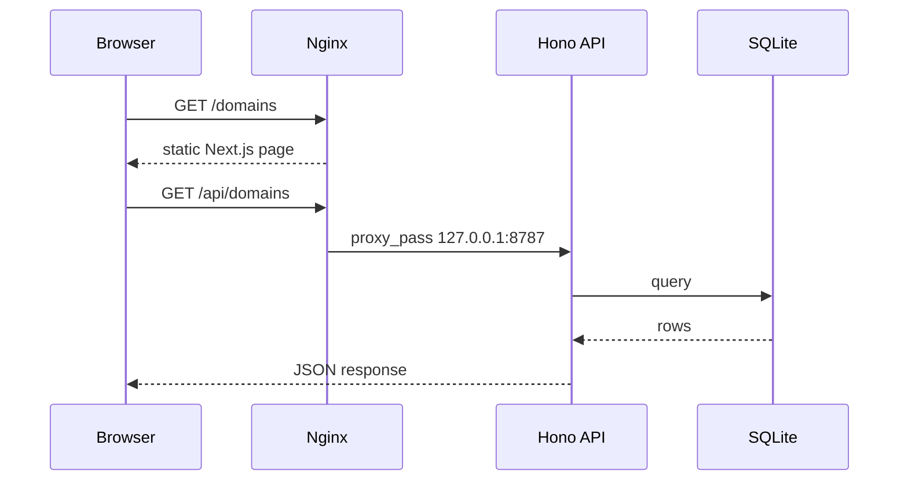
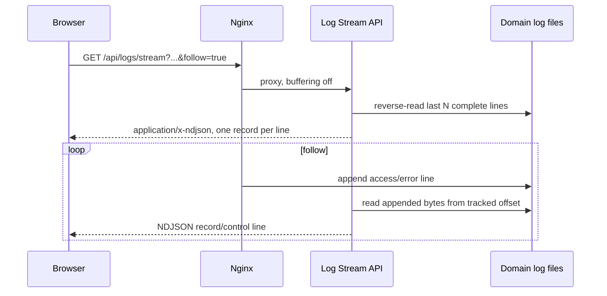
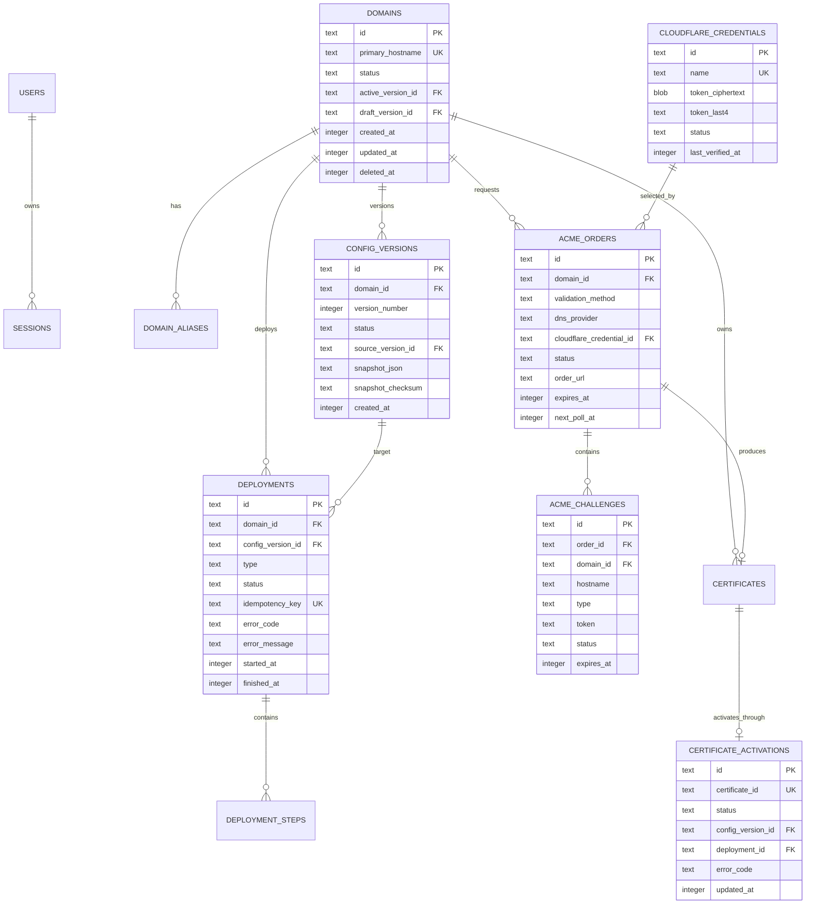
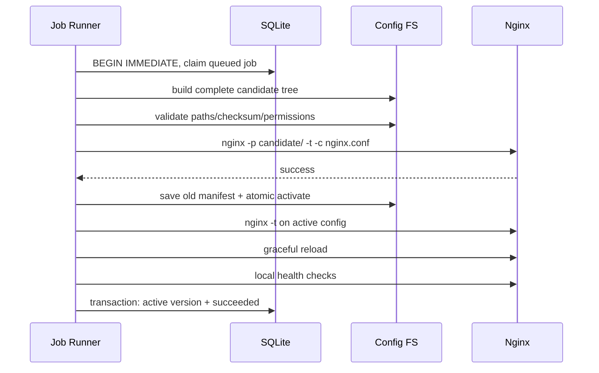

# Nginx Domain Manager 技术设计文档

> 版本：v1.10
>
> 状态：评审修订完成
>
> 更新日期：2026-07-20
> 关联文档：[产品需求文档](./PRD.md)

## 1. 目标与约束

本文定义 Nginx Domain Manager MVP 的可实施技术方案，重点回答：SQLite 如何持久化、Docker 镜像中的 Worker 如何安全控制 Nginx、配置如何生成/测试/发布/回滚，以及前后端如何落入当前仓库结构。

设计约束：

- 延续当前 Next.js Pages Router、React、shadcn/ui、Hono、Drizzle 和 Zod 技术栈。
- 使用 Node 运行时和 `better-sqlite3`，数据库文件位于持久卷。
- Web 静态产物、Hono API/部署 Worker 与 Nginx 打进同一个 Docker 镜像。
- 单实例、单 Nginx 节点；不引入消息队列或分布式锁。
- `NGINX_LOG_DIR` 是必填绝对路径，统一指定 Nginx 日志根目录；该路径必须挂载持久卷，域名日志目录不写入 SQLite。
- 任何候选配置都不能在通过完整 `nginx -t` 前替换线上配置。
- 用户业务模型是唯一事实来源；生成的 Nginx 文件是可重建产物。

## 2. 关键架构决策

### 2.1 Worker 采用 Node 运行时

当前仓库同时具备 Cloudflare Worker 入口 `src/worker/index.ts` 和 Node 入口 `src/worker/serve.ts`。生产 Docker 模式固定设置：

```text
DB_ENGINE=sqlite
DB_SQLITE_DIR=/data/db
RUNTIME_MODE=nginx-manager
NGINX_LOG_DIR=/data/logs
```

此模式复用同一个 Hono `createApp()`，但由 Node 进程承载。Cloudflare 边缘 Worker 无法可靠访问本机文件、运行 `nginx -t` 或 signal Nginx，因此不作为 Nginx Manager 的生产控制面。若保留 D1 构建路径，只用于模板原有示例或未来独立控制面，不参与本 MVP。

### 2.2 单镜像、三个运行单元

```mermaid
flowchart LR
  U[Browser] -->|80/443| N[Nginx]
  N -->|/api/*| W[Hono Node API + Deployment Worker]
  N -->|静态页面| F[Next.js static output]
  W --> DB[(SQLite /data/db/app.db)]
  W --> CF[/data/nginx configs]
  W --> CERT[/data/certs]
  W --> LOG[$NGINX_LOG_DIR/domain/access + error]
  W -->|exec nginx -t| N
  W -->|signal reload| N
  N --> UP[User upstreams / static volumes]
```

容器内运行：

- Nginx master/worker：对外提供站点、ACME challenge、管理端静态页面和 API 反代。
- Node API/Worker：处理 HTTP API、SQLite、任务队列、ACME、配置生成与发布，并提供日志分行读取、实时跟踪和轮动服务。
- 轻量进程监督器：启动/监控两个长期进程、转发 SIGTERM、回收僵尸进程。

推荐使用 `supervisord` 或等价的明确 supervisor，而不是依靠后台 shell `&`。最终镜像入口由 supervisor 作为 PID 1，停止时先停止接收新 API 任务，再 graceful quit Nginx。

### 2.3 非 root 运行

优先让 Node 与 Nginx 以同一专用 UID/GID 运行：

- 镜像构建时为 Nginx 二进制授予绑定低端口能力，或生产映射宿主机 80/443 到容器高端口 8080/8443。
- `/data`、`/run/nginx` 和 Nginx temp 目录归专用用户所有。
- Nginx pid 文件放在可写的 `/run/nginx/nginx.pid`。
- Worker 仅能写 `/data/nginx`、`/data/certs` 和 `/data/db`，不能写镜像系统目录。

若目标平台无法使用文件能力，容器内改为 8080/8443 是首选，避免让控制面长期以 root 运行。

### 2.4 不可变版本 + 原子激活

- SQLite 保存不可变 JSON snapshot 和 checksum。
- 每次发布在唯一候选目录生成完整配置树，绝不原地修改 active 文件。
- 测试候选“完整配置树”，包括所有当前 Active Domain 和目标 Domain 候选版本。
- 激活通过原子替换 active manifest/symlink 完成。
- reload 失败时恢复上一个 manifest 并再次 reload。

### 2.5 静态导出与动态业务 URL

当前 `next.config.ts` 使用 `output: "export"`。运行期未知的 Domain/Version ID 不能直接由 `[id].tsx` 在构建期枚举，因此不新增 Next.js 动态文件路由，也不为此引入常驻 Next.js Server。

实现采用静态详情壳页面 + Nginx internal rewrite：

- `/domains/:id/:tab`、`/domains/:id/ssl/orders/:orderId` 和 `/domains/:id/versions/:versionId[/diff]` 内部 rewrite 到导出的 `/domains/detail.html`。
- `/deployments/:deploymentId` 内部 rewrite 到 `/deployments/detail.html`。
- `/settings/:tab` 内部 rewrite 到导出的 `/settings.html`。
- 浏览器地址不重定向，详情壳从 `window.location.pathname` 解析受校验的 ID/Tab，再请求对应 API。
- `/domains`、`/domains/create`、`/deployments` 等已知静态路由保持独立导出页面，Nginx 规则必须给予更高优先级。

该方案保留 PRD 的语义 URL、刷新和深链能力，同时保持 Web 为静态产物。Nginx rewrite、客户端路径解析和不存在资源的 404 行为必须有 Docker E2E 覆盖。

当前 `next.config.ts` 同时声明静态导出和 `rewrites()`。生产静态导出必须移除 rewrites，`/api` 完全由 Nginx 代理；rewrites 只在开发模式返回。Phase 1 以 `pnpm build` 成功和导出目录不包含服务端 rewrite 依赖为门槛，具体配置分支需有构建测试。

### 2.6 管理端拓扑与保留主机名

- 生产要求 `MANAGER_URL=https://manager.example.com`，启动时解析并规范化 hostname，协议不是 HTTPS 则拒绝启动。
- 管理端 TLS 不进入 Domain/ACME 模型。部署方通过 `MANAGER_TLS_CERT_FILE`、`MANAGER_TLS_KEY_FILE` 挂载外部签发证书；文件缺失、私钥权限不安全或 SAN 不覆盖 `MANAGER_HOST` 时拒绝启动。
- 外部证书轮换必须先在相同挂载路径原子替换 cert/key，再调用认证后的 `reload-manager-tls` Diagnostics 操作；Worker 先校验证书链、key match、SAN 与 active `nginx -t`，通过后才 graceful reload 并验证管理端 HTTPS。若 UI/API 不可达，部署方的基线恢复方式是重启容器，由启动校验决定是否恢复服务；仅替换文件而不 reload/restart 不会生效。
- `MANAGER_HOST` 是系统保留 hostname。Domain/alias create/update 在数据库唯一性校验前先与其比较，命中返回 `DOMAIN_CONFLICT`。
- 生产 Session Cookie 始终 `Secure`。只有 `APP_ENV=development` 可用 loopback HTTP，并显式使用非 Secure 开发 Cookie；不存在“生产内网 HTTP”模式。
- General API/UI 只读返回 manager URL；运行时修改 server_name 不受支持。
- 管理端 server、内部 health listener、ACME default server 和用户 Domain server 是四类不同配置，用户版本不能覆盖前三类系统配置。

## 3. 仓库落位

建议按当前项目规则新增：

```text
src/
├── pages/
│   ├── login.tsx
│   ├── dashboard.tsx
│   ├── domains/
│   │   ├── index.tsx
│   │   ├── create.tsx
│   │   └── detail.tsx       # Nginx rewrite 后承载 Domain/Version 动态 URL
│   ├── certificates.tsx
│   ├── logs.tsx
│   ├── deployments/
│   │   ├── index.tsx
│   │   └── detail.tsx       # Nginx rewrite 后承载 Deployment 动态 URL
│   └── settings.tsx
├── components/pages/<page>/...
├── shared/schemas/
│   ├── domain.ts
│   ├── config-version.ts
│   ├── certificate.ts
│   ├── acme.ts
│   ├── cloudflare-credential.ts
│   ├── deployment.ts
│   ├── log.ts
│   ├── setting.ts
│   └── auth.ts
└── worker/
    ├── routes/
    │   ├── auth.ts
    │   ├── dashboard.ts
    │   ├── domains.ts
    │   ├── deployments.ts
    │   ├── certificates.ts
    │   ├── acme-challenges.ts
    │   ├── cloudflare-credentials.ts
    │   ├── logs.ts
    │   └── settings.ts
    ├── nginx/
    │   ├── config-generator.ts
    │   ├── directives.ts
    │   ├── filesystem.ts
    │   ├── runner.ts
    │   └── deployer.ts
    ├── acme/
    │   ├── client.ts
    │   ├── scheduler.ts
    │   ├── http-challenge.ts
    │   ├── dns-resolver.ts
    │   └── providers/
    │       ├── manual.ts
    │       └── cloudflare.ts
    ├── logs/
    │   ├── format.ts
    │   ├── reader.ts
    │   ├── stream.ts
    │   └── rotator.ts
    └── jobs/
        ├── queue.ts
        ├── runner.ts
        └── recovery.ts
```

所有 Zod Schema、Drizzle Table 和 inferred type 继续按项目规则放在同一个 domain schema 文件内，并由 `src/shared/schemas/index.ts` 统一导出。页面不直接调用 `fetch`，统一扩展 `src/lib/api.ts`。

当前 `drizzle.config.ts` 已指向 `src/shared/schemas/index.ts`，todo Schema 已删除；Phase 1 直接在统一导出中增加领域 Schema 并生成首个产品 migration。当前 `src/lib/api.ts` 仍包含 Tauri 检测和模板默认 URL；进入 Phase 1 前应删除 nginx-manager 不使用的 Tauri 分支/默认外部地址，保留同源 API 解析，避免生产请求意外发往模板站点。

## 4. 运行时与请求流

### 4.1 HTTP 请求



- `/api/*` 代理到 `127.0.0.1:8787`。
- 基础 Nginx 配置自启动起就在 port 80 default server 暴露 `/.well-known/acme-challenge/:token` 并反代 Worker；每个 Domain HTTP server 也注入同一固定 location，确保未发布和已发布 Domain 都无需为申请证书预先创建 Deployment。Nginx 透传原始 Host，不从本地 webroot 直接读文件。
- 管理端静态文件由镜像内只读目录提供。
- 用户 Domain server blocks include 自 `/data/nginx/active/`。

### 4.2 写请求与异步任务

普通 Domain/Route 编辑在 API 请求内完成短事务。可能执行外部命令或 reload 的操作只创建任务：

1. API 校验请求、权限、预期版本和幂等键。
2. 事务内插入 Deployment `queued`，立即返回 `202` 和任务 ID。
3. 单进程 Job Runner 领取最早任务并串行执行。
4. 前端轮询 `GET /api/deployments/:id`。
5. Runner 原子更新步骤和最终状态。

### 4.3 日志读取请求

历史和实时日志不写入 SQLite，Worker 直接从受控日志根目录按块读取：



- Nginx 管理 API location 对该接口设置 `proxy_buffering off`、足够长的 read timeout，并禁止响应压缩缓冲。
- Worker 使用 Web `ReadableStream`/Node stream 返回 `application/x-ndjson; charset=utf-8`，每个完整 JSON 对象后立即写 `\n`。
- 客户端 AbortController 断开时，服务端必须关闭文件描述符、定时器和 watcher。
- 历史查询与 follow 共用 cursor；客户端断线重连无需重新下载整个文件。

## 5. SQLite 设计

### 5.1 连接设置

打开数据库后执行：

```sql
PRAGMA journal_mode = WAL;
PRAGMA foreign_keys = ON;
PRAGMA busy_timeout = 5000;
PRAGMA synchronous = NORMAL;
```

约束：

- 整个 Node 进程复用一个 `better-sqlite3` 连接。
- Migration 在接收 HTTP 请求和启动 Job Runner 前执行。
- 时间统一保存 Unix epoch milliseconds（UTC）。
- JSON 以 canonical JSON 文本存储，并配套 SHA-256 checksum。
- 生产必须将 `/data` 挂载持久卷；不得将 SQLite 文件留在容器可写层。

### 5.2 ER 图



### 5.3 表定义

#### `users`

| 字段 | 类型/约束 | 说明 |
| --- | --- | --- |
| id | text PK | UUID/ULID |
| username | text unique not null | 规范化用户名 |
| password_hash | text not null | Argon2id 或 scrypt hash |
| created_at / updated_at | integer not null | UTC ms |

#### `sessions`

| 字段 | 类型/约束 | 说明 |
| --- | --- | --- |
| id_hash | text PK | Cookie token 的 hash，不保存明文 |
| user_id | text FK users cascade | 管理员 |
| expires_at / created_at | integer not null | 会话时间 |
| last_seen_at | integer not null | 可节流更新 |

#### `auth_attempts`

| 字段 | 类型/约束 | 说明 |
| --- | --- | --- |
| username_ip_hash | text PK | HMAC(purpose + 规范化用户名/用户 ID + Client IP)，不保存原始组合 |
| failure_count | integer not null | 当前 15 分钟窗口失败次数 |
| window_started_at / blocked_until | integer not null | UTC ms；达到 5 次后限流 |

HMAC key 固定由持久化 master secret 使用 HKDF-SHA-256 派生：`HKDF(master, salt="nginx-domain-manager", info="auth-attempts-v1")`；不得使用启动期随机值。该 master secret 与 Cloudflare 加密主密钥使用同一只读文件 `/run/secrets/nginx_manager_master_key`，部署时必须跨重启稳定；受控轮换 master key 时在维护事务中清空限流行并撤销所有 Session，避免新旧 key 混用。`purpose=login|password_change|rebuild_active` 进入 HMAC 输入，使三类限流互不覆盖。

登录成功清除对应 login 记录；过期记录由周期任务清理。失败计数/窗口滚动使用单条 SQLite UPSERT 在事务中原子完成，避免并发失败丢计数。登录在 15 分钟内第 5 次失败开始限流；密码修改当前密码校验在第 3 次失败后阻断 30 分钟；degraded 重建使用独立 purpose，在 15 分钟内第 5 次失败后阻断 15 分钟。所有失败响应保持统一状态码/文案，并对 IP 维度另设粗粒度上限以减轻用户名轮换攻击。

#### `domains`

| 字段 | 类型/约束 | 说明 |
| --- | --- | --- |
| id | text PK | Domain ID |
| primary_hostname | text unique not null | lowercase ASCII/Punycode |
| display_hostname | text not null | UI 展示值 |
| enabled | integer not null default 1 | boolean |
| runtime_status | text not null | unknown/running/failed/disabled |
| active_version_id | text nullable | 当前线上版本 |
| draft_version_id | text nullable | 最新草稿 |
| created_at / updated_at | integer not null | UTC ms |
| deleted_at | integer nullable | 软删除时间；保留历史版本和证书订单，历史日志目录由 Version 主域名推导 |

`active_version_id` 和 `draft_version_id` 的循环外键可在 SQLite migration 中使用 deferred foreign key，或保持应用层校验；删除版本在产品中不开放。

#### `domain_aliases`

| 字段 | 类型/约束 | 说明 |
| --- | --- | --- |
| id | text PK | Alias ID |
| domain_id | text FK domains cascade | 所属 Domain |
| hostname | text unique not null | 全局唯一规范化域名 |
| display_hostname | text not null | UI 展示值 |

#### `config_versions`

| 字段 | 类型/约束 | 说明 |
| --- | --- | --- |
| id | text PK | Version ID |
| domain_id | text FK domains restrict | 所属 Domain |
| version_number | integer not null | 域名内递增，unique(domain_id, version_number) |
| status | text not null | draft/testing/active/superseded/failed |
| source_version_id | text nullable FK self | rollback/copy 来源 |
| source_certificate_id | text nullable unique FK certificates | 自动证书激活版本的幂等来源 |
| change_summary | text not null | 用户可读摘要 |
| snapshot_json | text not null | 完整 DomainConfig |
| snapshot_checksum | text not null | canonical JSON SHA-256 |
| created_by | text FK users | 操作者 |
| created_at | integer not null | UTC ms |
| updated_at | integer not null | Draft 最近更新时间；历史版本等于最后一次有效更新时间 |

Route、Header 和 SSL 业务配置放进 snapshot，不拆成可变业务表。这样一次版本就是完整、一致、可回滚的聚合快照，避免跨表回滚。列表查询需要的主状态保留在 `domains` / `certificates` 投影表。

每个 Domain 最多存在一个 `status='draft'` 的 Version，由部分唯一索引 `config_versions_one_draft_per_domain` 保证。Draft 发布前允许通过 checksum CAS 原位更新；Active、Superseded 以及任何曾被 Deployment 引用的版本不可修改。

#### `certificates`

| 字段 | 类型/约束 | 说明 |
| --- | --- | --- |
| id | text PK | Certificate ID |
| domain_id | text FK domains restrict | 一个 Domain 可保留多个不可变证书资产 |
| acme_order_id | text unique FK acme_orders restrict | 来源 Order |
| provider | text not null | letsencrypt |
| environment | text not null | staging/production |
| status | text not null | ready/active/superseded/expired/revoked |
| sans_json | text not null | 覆盖域名列表，不含私钥 |
| cert_path / key_path | text not null | `/data/certs` 下受控相对路径 |
| cert_file_checksum | text not null | fullchain 文件 SHA-256，用于不可变资产/drift 校验 |
| public_key_spki_checksum | text not null | cert/key 匹配后的公钥 SPKI SHA-256，不保存私钥 hash |
| not_before / not_after | integer nullable | UTC ms |
| auto_renew | integer not null | boolean |
| last_validation_method | text nullable | http-01/dns-01，自动续期默认复用 |
| last_dns_provider | text nullable | manual/cloudflare |
| cloudflare_credential_id | text nullable FK set null | 上次成功使用的命名凭据 |
| last_error_code | text nullable | 可展示错误码 |
| issued_at / activated_at | integer nullable | 下载成功/首次发布成功时间 |
| next_check_at | integer nullable | Active Certificate 的续期计划 |

证书文件使用不可变目录 `/data/certs/<domain-id>/<certificate-id>/`；数据库只存受控相对路径和元数据。私钥权限 `0600`，目录 `0700`。Ready Certificate 不替换任何 active link；线上使用哪个证书由 Active Config Version 的 `ssl.certificateId` 唯一决定。

#### `cloudflare_credentials`

| 字段 | 类型/约束 | 说明 |
| --- | --- | --- |
| id | text PK | Credential ID |
| name | text unique not null | 管理员可识别的名称 |
| token_ciphertext | blob not null | AES-256-GCM 密文 |
| token_iv / token_auth_tag | blob not null | 每条随机 IV 与认证标签 |
| token_last4 | text not null | UI 识别，不用于认证 |
| cloudflare_token_id | text nullable | Verify API 返回的 token tag |
| status | text not null | unknown/active/invalid/expired |
| expires_at | integer nullable | Cloudflare token 到期时间 |
| visible_zone_count | integer nullable | 最近一次验证可见 Zone 数 |
| last_verified_at / last_used_at | integer nullable | 审计时间 |
| created_at / updated_at | integer not null | UTC ms |

Token 加密主密钥从 `/run/secrets/nginx_manager_master_key` 读取，不放入镜像、SQLite 或普通环境日志。API 永不返回 ciphertext、IV、tag 或 token 明文；替换 token 使用新的 IV 并覆盖旧密文。

#### `acme_orders`

| 字段 | 类型/约束 | 说明 |
| --- | --- | --- |
| id | text PK | Order ID |
| domain_id | text FK domains restrict | 所属 Domain |
| replaces_certificate_id | text nullable FK certificates | 续期时被替换的 Active Certificate |
| validation_method | text not null | http-01/dns-01 |
| dns_provider | text nullable | manual/cloudflare |
| cloudflare_credential_id | text nullable FK set null | Cloudflare 模式创建时必填；历史凭据删除后可空 |
| cloudflare_credential_name | text nullable | 创建时名称快照，用于历史审计 |
| account_email | text not null | 规范化 ACME account 邮箱，用于与 environment 一起恢复 account |
| environment | text not null | staging/production |
| status | text not null | preparing/waiting_http/waiting_dns/validating/validated/downloading/succeeded/failed/expired/cancelled |
| order_url | text nullable | ACME Order URL |
| identifiers_json | text not null | 规范化 hostname 列表 |
| unpublished_base_version_id | text nullable FK config_versions | Order 创建时 Domain 尚无 Active Version 才锁定的首次发布基线 |
| cleanup_status | text not null | pending/succeeded/failed；不改变 Order success |
| next_poll_at / last_polled_at | integer nullable | 可恢复轮询调度 |
| expires_at | integer nullable | Order/Challenge 有效期 |
| error_code / error_message | text nullable | 脱敏错误 |
| created_at / updated_at | integer not null | UTC ms |

#### `acme_challenges`

| 字段 | 类型/约束 | 说明 |
| --- | --- | --- |
| id | text PK | Challenge ID |
| order_id | text FK acme_orders cascade | 所属 Order |
| domain_id | text FK domains restrict | 用于 well-known 快速校验 |
| hostname | text not null | 本次授权 hostname |
| type | text not null | http-01/dns-01 |
| token | text nullable | HTTP URL token，临时明文 |
| key_authorization | text nullable | HTTP 响应体，临时明文 |
| dns_record_name / dns_record_value | text nullable | TXT 指令 |
| cloudflare_zone_id / cloudflare_record_id | text nullable | 只清理本 Order 创建的记录 |
| status | text not null | pending/presented/propagating/ready/valid/invalid/cleaning/cleaned |
| expires_at | integer not null | 过期后 well-known 必须 404 |
| created_at / updated_at / cleaned_at | integer nullable | 生命周期 |

Challenge 数据只在订单恢复和验证期间保留；进入终态的同一事务立即清空 `token`、`key_authorization`、DNS value，并保留不含秘密的结果元数据用于审计。启动/周期 sweeper 仅修复进程在终态事务前后中断造成的残留，不作为正常延迟清理路径。

#### `certificate_activations`

| 字段 | 类型/约束 | 说明 |
| --- | --- | --- |
| id | text PK | Activation ID |
| certificate_id | text unique FK certificates restrict | 一个 Ready Certificate 对应一个自动激活链 |
| status | text not null | pending/creating_version/creating_deployment/created/failed |
| config_version_id | text nullable FK config_versions | 必须先创建 |
| deployment_id | text nullable FK deployments | Version 成功后才创建 |
| error_code / error_message | text nullable | 下游错误，不回写 ACME Order |
| next_attempt_at | integer nullable | 自动恢复时间 |
| created_at / updated_at | integer not null | UTC ms |

该表是证书签发与发布之间的显式边界。Order API 可以 join 后展示，但 `acme_orders` 不保存 Activation、Version 或 Deployment 状态。

#### `deployments`

| 字段 | 类型/约束 | 说明 |
| --- | --- | --- |
| id | text PK | Deployment ID |
| domain_id | text nullable FK | 域名；全局任务可空 |
| config_version_id | text nullable FK | 目标版本 |
| type | text not null | test/deploy/rollback/remove_domain/toggle_domain/apply_log_settings/rotate_logs/rebuild_active/reload_manager_tls |
| status | text not null | queued/running/succeeded/failed/interrupted |
| idempotency_key | text unique not null | 防重复提交 |
| previous_version_id | text nullable | 恢复依据 |
| input_json | text nullable | 非 Domain 任务的不可变输入，如目标日志设置；禁止 secrets |
| error_code / error_message | text nullable | 脱敏错误 |
| requested_by | text FK users | 操作者/系统账号 |
| created_at / started_at / finished_at | integer | 时间 |

#### `deployment_steps`

| 字段 | 类型/约束 | 说明 |
| --- | --- | --- |
| id | text PK | Step ID |
| deployment_id | text FK cascade | 任务 |
| sequence | integer not null | 顺序 |
| name | text not null | 固定步骤名 |
| status | text not null | pending/running/succeeded/failed/skipped |
| message | text nullable | 脱敏摘要 |
| log_excerpt | text nullable | 限长、脱敏日志 |
| started_at / finished_at | integer nullable | 时间 |

#### `settings`

Key/value 表仅保存非敏感实例设置；value 使用 JSON，key 为枚举白名单。Cloudflare token 只进入专用加密凭据表；加密主密钥通过 Docker secret/file 注入，不进入此表。

允许的 key 只有：

- `general`：`instanceName`、IANA `timezone`；`MANAGER_URL` 来自环境且只读，不入库。
- `acme_defaults`：默认邮箱、`staging|production`、续期阈值 7–45 天、`http-01|dns-manual|dns-cloudflare` 默认验证方式。
- `nginx_logs`：全局日志格式、error level 和轮动策略。
- `security_session`：会话有效期；不包含密码、Cookie 或 CSRF secret。
- `runtime_storage`：`revisionMaxBytes`，512 MiB–20 GiB，默认 2 GiB；运行时可修改，不进入 Nginx 配置 checksum。

日志设置使用固定 key `nginx_logs`，value 通过共享 Schema 校验，至少包含：

```ts
type NginxLogSettings = {
  revision: number;
  accessFields: AccessLogField[];
  errorLevel: "error" | "warn" | "notice" | "info";
  maxFileSizeMiB: number; // 1..1024
  retainedFiles: number;  // 1..30，不含当前文件
  updatedAt: number;
};
```

设置保存时以当前 active revision + 1 构建候选，并写入 type=`apply_log_settings` Deployment 的 `input_json`；`settings.nginx_logs` 在任务完成前仍保留旧 active 值。只有完整配置测试和 reload 成功后，才在事务中用候选替换 active 设置。日志文件的 offset、当前大小等高频状态不写 SQLite。

### 5.4 索引

- `domains(primary_hostname)` unique。
- `domain_aliases(hostname)` unique、`domain_aliases(domain_id)`。
- `config_versions(domain_id, version_number)` unique。
- `config_versions(source_certificate_id) WHERE source_certificate_id IS NOT NULL` unique，保证一个 Ready Certificate 只自动生成一个证书版本。
- `deployments(status, created_at)` 用于任务领取。
- `deployments(domain_id, created_at desc)` 用于历史。
- `certificates(domain_id, status)` 用于 Ready/Active 资产；`certificates(domain_id) WHERE status = 'active'` partial unique；`certificates(status, not_after)` 用于续期扫描；`certificates(acme_order_id)` unique。
- `cloudflare_credentials(name)` unique。
- `acme_orders(status, next_poll_at)` 用于验证轮询恢复；同一 certificate/domain 的非终态续期 Order 在事务内保持唯一。
- `certificate_activations(status, next_attempt_at)` 用于独立恢复 Version/Deployment 创建。
- `acme_challenges(domain_id, hostname, token, status, expires_at)` 用于 HTTP-01；`acme_challenges(order_id, hostname)` unique。
- `sessions(expires_at)` 用于清理。
- `auth_attempts(blocked_until)` 用于登录限流和过期清理。

## 6. DomainConfig Schema

业务快照建议使用判别联合：

```ts
type DomainConfig = {
  schemaVersion: 1;
  primaryHostname: string;
  aliases: string[];
  routes: RouteConfig[];
  headers: HeaderConfig[];
  ssl: {
    enabled: boolean;
    certificateId?: string; // 仅引用已下载、status=ready|active 的不可变资产
    provider: "letsencrypt";
    environment: "staging" | "production";
    email: string;
    autoRenew: boolean;
    forceHttps: boolean;
    validation:
      | { method: "http-01" }
      | { method: "dns-01"; provider: "manual" }
      | {
          method: "dns-01";
          provider: "cloudflare";
          cloudflareCredentialId: string;
        };
  };
  advanced: { serverSnippet: string };
};

type RouteConfig =
  | {
      id: string;
      type: "proxy";
      path: string;
      target: string;
      websocket: boolean;
      preserveHost: boolean;
      connectTimeoutSeconds: number;
      readTimeoutSeconds: number;
      sendTimeoutSeconds: number;
      enabled: boolean;
      order: number;
    }
  | {
      id: string;
      type: "static";
      path: string;
      root: string;
      index: string;
      spaFallback: boolean;
      enabled: boolean;
      order: number;
    }
  | {
      id: string;
      type: "redirect";
      path: string;
      target: string;
      statusCode: 301 | 302;
      enabled: boolean;
      order: number;
};
```

`enabled` 不属于 `DomainConfig`；它是 `domains.enabled` 的运行时投影。不可变 Version 描述 Domain 启用时的业务行为，Candidate Builder 在发布时显式叠加 enabled 状态。这样 toggle 不创建/改写 Config Version，回滚和证书激活也不会隐式启停 Domain。

Schema 演进通过 `schemaVersion` 和纯函数 migration 完成。读取旧快照时迁移到当前内存模型，但不得覆盖历史原文；只有创建新版本时写当前 Schema。

## 7. API 设计

### 7.1 约定

- 对外业务 API Base path：`/api`；唯一内部例外是只经 loopback health listener 到达的 `/internal/health`。
- JSON 错误格式：`{ code: string, message: string, fieldErrors?: Record<string,string[]> }`。
- 列表：`page`, `pageSize`, `search`, `status`, `sort`；响应 `{ items, page, pageSize, total }`。
- 写请求接受 `Idempotency-Key`；版本编辑同时传 `If-Match: <snapshotChecksum>` 或 `expectedVersionId`。
- 创建长任务返回 `202 Accepted` 和 `{ deploymentId, statusUrl }`。
- 认证使用 HttpOnly Session Cookie；敏感写操作验证 Origin/CSRF token。

### 7.2 Auth 与 Dashboard

| Method | Path | 用途 |
| --- | --- | --- |
| GET | `/api/setup/status` | 是否需要首次初始化 |
| POST | `/api/setup/admin` | 创建唯一初始管理员，仅未初始化时可用 |
| POST | `/api/auth/login` | 登录并设置 Cookie |
| POST | `/api/auth/logout` | 注销当前会话 |
| GET | `/api/auth/me` | 当前用户 |
| GET | `/api/dashboard` | 卡片、待处理项、最近活动聚合 |
| GET | `/api/health` | API/DB/Nginx 摘要健康检查 |
| GET | `/internal/health` | 仅供 loopback Nginx health listener；免 Session/CSRF/manager Host guard，外部 listener 永不转发 |

### 7.3 Domains 与 Versions

| Method | Path | 用途 |
| --- | --- | --- |
| GET | `/api/domains` | 列表/搜索/筛选 |
| POST | `/api/domains` | 创建 Domain + v1 草稿 |
| GET | `/api/domains/:id` | Overview 聚合 |
| PATCH | `/api/domains/:id` | 修改基本信息并创建或更新当前 Draft；有非终态 Order 时 hostname/aliases 变更返回 `DOMAIN_HAS_ACTIVE_ORDER` |
| POST | `/api/domains/:id/disable` | 创建 `toggle_domain` Deployment；成功后 challenge 保留、业务请求 503 |
| POST | `/api/domains/:id/enable` | 创建 `toggle_domain` Deployment；成功后恢复当前 Active Version 路由 |
| DELETE | `/api/domains/:id` | 未发布时软删除；已发布时创建 remove task，成功后软删除并保留日志归档 |
| GET | `/api/domains/:id/versions` | 历史版本 |
| GET | `/api/domains/:id/versions/:versionId` | 快照和版本 Nginx 预览；不混入线上 enabled、日志路径等运行时值 |
| POST | `/api/domains/:id/versions` | 提交完整目标 `DomainConfig`；创建下一 Draft 或以 checksum CAS 原位更新当前 Draft |
| GET | `/api/domains/:id/versions/:versionId/diff?base=` | 语义/JSON/版本 Nginx Diff |
| GET | `/api/domains/:id/versions/:versionId/publish-preview` | 聚合语义/JSON/Nginx Diff 与目标 checksum；首次发布允许空基线 |
| POST | `/api/domains/:id/versions/:versionId/test` | 校验 `expectedSnapshotChecksum` 并创建 test Deployment |
| POST | `/api/domains/:id/versions/:versionId/deploy` | 校验成功 preflight、Version 与 checksum 后创建 deploy Deployment |
| POST | `/api/domains/:id/versions/:versionId/rollback` | 复制快照并创建 rollback Deployment |

Routes、Headers、SSL、Advanced 的页面保存都提交完整目标 `DomainConfig`，并携带 `If-Match: <当前草稿 snapshotChecksum>`；服务端不接受局部 patch，也不与“最新草稿”隐式合并。服务端 canonicalize + Schema/领域校验后比较 checksum：已有 Draft 时以旧 checksum 为条件 CAS 更新同一行；没有 Draft 时创建下一版本号；无变化时返回 `mode="unchanged"`；不匹配返回 `409 VERSION_CONFLICT`。响应通过 `mode="created"|"updated"|"unchanged"` 表达结果。各 Tab 加载并持有整份快照，只替换自己负责的 section 后提交全量对象。MVP 不为 snapshot 内部元素建立独立 CRUD API。

Overview、Routes、SSL、Headers、Advanced 共用三步发布向导。Step 1 读取 `publish-preview`；Step 2 创建 checksum-bound Test Deployment；Step 3 必须提交同 Domain、Version、checksum 的成功 Test Deployment ID。Test 不锁 Draft，但 Draft 变化会使结果失效；Deploy 从排队到终态期间锁定目标 Draft，保存返回 `DRAFT_DEPLOYMENT_RUNNING`。preflight 不能替代 Runner 的完整 candidate `nginx -t`。

Toggle 边界：无 Active Version 的 Domain 调用 disable 返回 `409 DOMAIN_NO_ACTIVE_VERSION`；目标态已等于当前投影时返回 `200 {changed:false, enabled}` 且不创建 Deployment/占锁。相同目标已有非终态 `toggle_domain` 时返回 `202` 和原 deploymentId；相反目标在其结束前返回 `409 DEPLOYMENT_ALREADY_RUNNING`。Disabled Domain 仍允许保存草稿、对草稿执行只读 test，以及申请/续期/激活证书。Test candidate 对目标 Version 按“would-be enabled”生成域名配置以覆盖 Route 语法，但绝不激活；证书 Activation Deployment 携不可变 activationId/sourceCertificateId，Runner 允许其更新 TLS 引用，同时 disabled 状态仍输出 503。普通业务版本 deploy/rollback 返回 `409 DOMAIN_DISABLED`，必须先 enable。

### 7.4 Certificates、Deployments、Settings

| Method | Path | 用途 |
| --- | --- | --- |
| GET | `/api/certificates` | 证书列表 |
| GET | `/api/domains/:id/certificates` | Domain 的 Ready/Active/Superseded 证书资产 |
| GET | `/api/domains/:id/certificates/:certificateId` | 单个证书元数据与来源 Order，不返回私钥 |
| POST | `/api/domains/:id/certificate/orders` | 校验方式/凭据并创建 ACME Order，返回 orderId |
| POST | `/api/domains/:id/certificate/renew` | 按上次成功策略创建唯一续期 Order |
| GET | `/api/domains/:id/certificate/orders/:orderId` | Order、Challenge、轮询和清理状态 |
| POST | `/api/domains/:id/certificate/orders/:orderId/recheck` | Manual DNS/HTTP 立即检查，去抖且不新建 Order |
| POST | `/api/domains/:id/certificate/orders/:orderId/credential` | Cloudflare 凭据失效时更换并重新校验 Zone |
| POST | `/api/domains/:id/certificate/orders/:orderId/cancel` | 取消 Order 并清理临时 Challenge |
| POST | `/api/domains/:id/certificates/:certificateId/activate` | Ready Certificate 的 Activation 失败时，幂等重试创建 Version/Deployment |
| GET | `/api/deployments` | 全局发布历史 |
| GET | `/api/deployments/:id` | 任务和步骤 |
| POST | `/api/deployments/:id/retry` | 以同参数创建新任务，关联原任务 |
| GET/PATCH | `/api/settings/general` | 实例名、时区；响应附带环境派生的只读 managerUrl/managerHost |
| GET/PATCH | `/api/settings/acme` | ACME 默认邮箱、环境、续期阈值、默认验证方式 |
| GET | `/api/settings/nginx` | Nginx 版本、只读路径、运行配置用量/上限和最近健康检查 |
| PATCH | `/api/settings/nginx` | 仅修改 `runtime_storage.revisionMaxBytes`；立即生效并触发 cleanup，不 reload |
| POST | `/api/settings/security/password` | 校验当前密码后修改管理员密码并撤销其他会话 |
| GET/PATCH | `/api/settings/security/session-policy` | 会话有效期 |
| POST | `/api/auth/sessions/revoke-all` | 撤销当前管理员全部会话；响应后当前 Cookie 同时失效 |
| GET | `/api/settings/diagnostics` | SQLite/卷空间、Worker/Nginx 状态；可返回当前/历史 `NGINX_LOG_DIR` 供迁移诊断，其他敏感路径仍脱敏 |
| GET | `/api/settings/diagnostics/runtime-config?domainId=` | 当前 Active Revision 的 runtime server/manifest checksum，只读并脱敏绝对敏感路径 |
| POST | `/api/settings/diagnostics/nginx-test` | 创建全局 test 任务 |
| POST | `/api/settings/diagnostics/rebuild-active` | 仅 degraded 可用，按 SQLite Active Version 创建 `rebuild_active` Deployment |
| POST | `/api/settings/diagnostics/reload-manager-tls` | 校验外部挂载管理证书后创建 `reload_manager_tls` Deployment |

公开 HTTP-01 端点不使用 `/api` 前缀，也不要求 Session：

| Method | Path | 用途 |
| --- | --- | --- |
| GET/HEAD | `/.well-known/acme-challenge/:token` | 按规范化 Host + token 返回未过期 `keyAuthorization` |

该端点成功响应为 `200 text/plain`；Host 不属于启用 Domain、token 不匹配、非 HTTP Challenge、已过期或终态均返回同样的 `404`，不得暴露差异。

Order API 的 `succeeded` 只代表 Certificate 已下载并保存为 Ready。响应可聚合附带 `certificateId` 及其 Activation 的 `configVersionId`/`deploymentId` 方便页面展示，但这些字段来自关联表；后两者为空/失败都不得改变 Order 状态。

Certificate 列表/详情响应 join `domains.enabled`。数据库 `Certificate.status` 仍保持 `active`（因为 disabled runtime server 确实引用证书），API 另返回 `domainEnabled` 和派生 `presentationStatus="active_domain_disabled"` 供 UI 显示；不得为了文案把证书状态改成 Ready/Superseded。

### 7.5 Cloudflare Credentials

| Method | Path | 用途 |
| --- | --- | --- |
| GET | `/api/settings/cloudflare-credentials` | 列出名称、尾号、状态和验证元数据，不返回 token |
| POST | `/api/settings/cloudflare-credentials` | Verify token、加密并保存命名凭据 |
| PATCH | `/api/settings/cloudflare-credentials/:id` | 修改名称或用新 token 替换 |
| POST | `/api/settings/cloudflare-credentials/:id/verify` | 重新 Verify 并刷新可见 Zone 摘要 |
| POST | `/api/settings/cloudflare-credentials/:id/validate-zones` | 验证 token 能覆盖请求的全部 hostname |
| DELETE | `/api/settings/cloudflare-credentials/:id` | 无活动 Order 引用时删除；续期引用需确认 |

### 7.6 Logs

| Method | Path | 用途 |
| --- | --- | --- |
| GET | `/api/logs/domains` | 返回 Active/Archived Domain、文件大小和最后写入时间；支持 `archiveStatus` 筛选 |
| GET | `/api/logs/history` | 历史尾部/向前分页查询 |
| GET | `/api/logs/follow` | 实时 follow 的 NDJSON 流 |
| GET | `/api/settings/logs` | 当前 active/pending 日志设置与只读 Nginx 预览 |
| PUT | `/api/settings/logs` | 校验新 revision 并创建 `apply_log_settings` Deployment |
| POST | `/api/logs/rotate` | 创建全局或指定 Domain 的 `rotate_logs` 任务 |

日志查询参数：

- `domainId`：可重复传入，单 Domain Tab 传一个；实时 follow 支持 1–20 个，服务端在同一 NDJSON 流中 multiplex 并由每条记录的 `domainId` 标识来源。
- `scope=all`：仅允许有界历史查询，由服务端枚举 Domain；不能与 `follow=true` 同时使用。
- `types=access,error`：去重并固定排序，至少一项；过渡期兼容旧 `type=access|error|all`，两者同时出现返回校验错误。
- `follow=true|false`；`follow=true` 时必须显式选择 1–20 个 Domain。
- `limit=1..2000`，默认 200。
- `cursor`：服务端签发的不透明游标，包含文件 generation、byte offset、方向和查询作用域的签名，不接受客户端文件路径。
- `from` / `to`、`method`、`status`、`path`、`clientIp`、`level`、`query`。

`/history` 返回 JSON 分页结果；`/follow` 的 Content-Type 为 `application/x-ndjson`，每一行是以下判别联合之一：

```ts
type LogStreamRecord =
  | {
      type: "entry";
      domainId: string;
      logType: "access" | "error";
      cursor: string;
      timestamp: string | null;
      parsed: boolean;
      fields?: Record<string, string | number | null>;
      raw: string;
      truncated: boolean;
    }
  | { type: "heartbeat"; at: string; cursor?: string }
  | { type: "rotated"; previousFileId: string; nextFileId: string; cursor: string }
  | { type: "dropped"; count: number; reason: "rate_limit" | "client_backpressure" }
  | { type: "end"; reason: "server_shutdown" | "stream_limit"; cursor?: string }
  | { type: "error"; code: "cursor_expired" | "file_unavailable"; recoverable: boolean };
```

HTTP 状态只表达请求级错误；流建立后的状态通过控制行表达。Heartbeat 默认 15 秒，用于穿过反向代理 idle timeout。每个连接限制 1,000 行/秒、2 MiB/秒、64 KiB/单行和 30 分钟，达到期限由客户端携 cursor 重连。

单进程用共享 semaphore 限制实例级最多 20 个 follow 连接，并按 sessionId 限制最多 5 个；每个连接仍最多 20 个 Domain。建立流前超限返回 `429` + `LOG_STREAM_CAPACITY_EXCEEDED`，不先发送 NDJSON header；连接建立后到达 30 分钟或因运行时资源水位保护而关闭时，先发送 `{type:"end", reason:"stream_limit", cursor}` 再释放 watcher/FD。客户端使用 cursor 退避重连；Archived Domain 只允许有界历史读取，不允许 follow。

## 8. Nginx 配置生成器

### 8.1 原则

- 对外只保留三个直接、确定性的配置生成函数：
  - `renderDomainConfig(input): string`：接收 `mode="runtime" | "preview"` 的判别输入，组合一个 Domain 的完整 server 配置。
  - `renderRootConfig(input): string`：生成全局 `events/http`、日志格式、公共 `map`，并 `include domains/*.conf`。
  - `renderDomainPreview(snapshot): string`：以 `mode="preview"` 调用 `renderDomainConfig()` 的薄封装，只根据 Version 生成预览/Diff。
- 两种 mode 必须走同一套 Route、Header、SSL 指令结构和 Advanced 白名单生成路径，不能复制两份模板。差异只允许出现在 Domain enabled overlay、日志指令和证书路径解析：preview 按 Domain enabled=true 展示业务配置、不输出日志指令，证书路径改用稳定 Certificate ID 占位符；runtime 叠加实际 enabled、`NGINX_LOG_DIR` 和不可变证书文件路径。
- Preview 中引用证书时固定输出 `ssl_certificate <certificate:{certificateId}:fullchain>;` 和 `ssl_certificate_key <certificate:{certificateId}:private-key>;`。占位符只用于展示/Diff，Preview 不参与 `nginx -t`；Certificate ID 的增删或替换必须形成可见文本差异。
- 输入必须先通过 Zod；生成器不接受任意 Nginx 文本片段。
- 所有 token 根据语境编码/校验，不用模板字符串直接拼接未经验证的输入。
- 域名文件按 Domain ID 稳定排序；相同输入必须生成相同 bytes，便于 checksum、Diff 和回归测试。
- 文件名使用 Domain ID，不直接使用 hostname，避免路径注入。

### 8.2 根配置布局

```text
/data/nginx/
├── candidates/<deployment-id>/
│   ├── nginx.conf
│   ├── manifest.json
│   └── domains/<domain-id>.conf           # 完整 runtime server 文件
├── revisions/<deployment-id>/         # 发布成功的完整运行时树，结构同 candidate
├── active -> revisions/<deployment-id> # 通过临时 symlink + rename 原子替换
└── backups/<deployment-id>/           # 失败恢复现场，保留 7 天
/data/acme/
├── accounts/<environment>/<email-hash>/account.key
└── orders/<order-id>/private.key     # 待签发证书私钥，0600，支持 Order 恢复
/data/certs/<domain-id>/<certificate-id>/
├── fullchain.pem
└── private.key
$NGINX_LOG_DIR/<normalized-primary-hostname>/
├── access.log
├── access.log.1 ... access.log.N
├── error.log
└── error.log.1 ... error.log.N
```

SQLite `snapshot_json`/checksum 是 Config Version 的唯一业务事实来源。版本 Nginx 预览由 `renderDomainPreview()` 按请求生成，不单独落盘。发布任务读取每个 Active Version snapshot，叠加 `domains.enabled`、active Log Settings 与证书元数据，在 candidate 的 `domains/` 下逐个生成完整 server `.conf`；根配置只通过 `include domains/*.conf` 组合这些文件。`manifest.json` 记录每个文件的来源字段和 checksum，保证线上文件可追溯且启动时能检测漂移。

根配置固定采用一个 include 汇总所有 Domain：

```nginx
http {
  # 全局 log_format、map、mime 等系统指令
  include domains/*.conf;
}
```

Candidate 测试使用 `nginx -p /data/nginx/candidates/<deployment-id>/ -t -c nginx.conf`，线上 Nginx 使用 prefix `/data/nginx/active/`；因此同一个相对 include 分别读取 candidate 或 active 下的 `domains/*.conf`，不涉及 Version symlink。

`manifest.json` 只记录恢复和校验真正需要的事实，不引入额外状态 checksum 类型：

```ts
type RuntimeManifestV1 = {
  schemaVersion: 1;
  rootConfigChecksum: string;
  logSettings: { revision: number; checksum: string };
  rootInputs: {
    appEnv: "production" | "development";
    managerUrl: string;
    listeners: { publicHttp: string; publicHttps: string; internalHealth: string };
    managerTls: { certPath: string; keyPath: string };
    uiRoot: string;
    apiUpstream: "http://127.0.0.1:8787";
    staticAllowedRoots: string[];
    certsRoot: string;
    logsRoot: string; // 启动时读取的 NGINX_LOG_DIR 绝对路径
  };
  domains: Record<string, {
    sourceVersionId: string;
    snapshotChecksum: string;
    enabled: boolean;
    certificate: null | {
      certificateId: string;
      certFileChecksum: string;
      publicKeySpkiChecksum: string;
    };
    configChecksum: string; // domains/<domain-id>.conf 原始 bytes SHA-256
  }>;
};
```

数组和值在写 manifest 前规范化，manifest 本身不保存 secret。启动时直接用 SQLite 当前 Active Version、enabled、日志设置和证书元数据逐字段对比 manifest，并确认 `rootInputs.logsRoot` 等于当前 `NGINX_LOG_DIR`；随后校验根配置/每个域名文件 checksum 并执行 `nginx -t`。不记录或比较生成器 build ID；镜像升级不会仅因生成代码版本变化进入 degraded。

成功 candidate 先 rename 为不可变 revision，再以同目录临时 symlink + rename 原子替换 `active` symlink；不能逐文件覆盖 active。

### 8.3 Server block 结构

配置树明确区分四类 listener/server：

1. **管理端 HTTP server**：`server_name <MANAGER_HOST>`，只做 `308 https://<MANAGER_HOST>$request_uri`。管理端证书不走产品自身 ACME。
2. **管理端 HTTPS server**：仅 `server_name <MANAGER_HOST>`，使用只读挂载的 `MANAGER_TLS_CERT_FILE`/`MANAGER_TLS_KEY_FILE`，静态根指向 Next export；`/api/` 代理 loopback Worker，其余业务深链由静态壳 fallback。`/internal/health` 在此 public server 显式返回 404。
3. **内部 health server**：只监听 `127.0.0.1:8082`，`location = /internal/health` 代理 Hono，免 Session；容器 healthcheck 只访问此 listener，对外端口不映射。
4. **用户 Domain server**：base port 80 default server 仅代理 ACME challenge、其余 404；每个 Domain 的 port 80 始终保留 challenge，force HTTPS 时其余请求 308，否则承载路由；配置版本引用 Ready/Active Certificate 后才生成 port 443 TLS server。

管理端核心配置等价于：

```nginx
server {
  listen 80;
  server_name manager.example.com;
  return 308 https://manager.example.com$request_uri;
}
server {
  listen 443 ssl;
  server_name manager.example.com;
  ssl_certificate     /run/secrets/manager/fullchain.pem;
  ssl_certificate_key /run/secrets/manager/private.key;
  root /opt/nginx-manager/ui;

  location = /internal/health { return 404; }
  location /api/ {
    proxy_pass http://127.0.0.1:8787;
    proxy_set_header Host $host;
    proxy_set_header X-Forwarded-Proto https;
    proxy_set_header X-Request-Id $request_id;
    proxy_set_header X-Internal-Health-Check "";
  }

  # 已知静态列表/创建页优先，避免被动态 ID 规则吞掉
  location = /domains        { try_files /domains.html =404; }
  location = /domains/create { try_files /domains/create.html =404; }
  location = /deployments    { try_files /deployments.html =404; }

  # 动态语义 URL 内部落到静态详情壳；浏览器 URL 不改变
  location ~ ^/domains/[A-Za-z0-9_-]+/(overview|routes|ssl|headers|advanced|logs|history)$ {
    rewrite ^ /domains/detail.html last;
  }
  location ~ ^/domains/[A-Za-z0-9_-]+/ssl/orders/[A-Za-z0-9_-]+$ {
    rewrite ^ /domains/detail.html last;
  }
  location ~ ^/domains/[A-Za-z0-9_-]+/versions/[A-Za-z0-9_-]+(/diff)?$ {
    rewrite ^ /domains/detail.html last;
  }
  location ~ ^/deployments/[A-Za-z0-9_-]+$ {
    rewrite ^ /deployments/detail.html last;
  }
  location ~ ^/settings/(general|acme|cloudflare|logs|nginx|security|diagnostics)$ {
    rewrite ^ /settings.html last;
  }
  location = /settings { return 302 /settings/general; }
  location / { try_files $uri $uri.html =404; }
}
server {
  listen 127.0.0.1:8082;
  server_name _;
  location = /internal/health {
    proxy_pass http://127.0.0.1:8787;
    proxy_set_header Host 127.0.0.1;
    proxy_set_header X-Internal-Health-Check 1;
  }
  location / { return 404; }
}
```

示例 hostname/path 由启动时验证后的环境配置渲染，不接受 UI 输入。Worker 的管理 API 再校验请求 Host 必须等于 `MANAGER_HOST`；Domain 创建/修改也必须拒绝该保留 hostname。生产启动时证书/私钥缺失、不可读、私钥不匹配或 SAN 不覆盖 `MANAGER_HOST` 均直接失败。开发模式仅可在 loopback 使用 HTTP 和非 Secure Cookie。

未取得证书前不得生成引用不存在证书文件的 TLS server。HTTP-01 的 base challenge proxy 随容器启动存在，不要求先发布 Domain；证书下载成功即关闭 Order。之后由独立编排创建引用 Certificate ID 的 Config Version，再创建 Deployment。DNS-01 不要求公网 80，并遵循相同的“Order 先闭环、发布后创建”规则。

域名配置生成函数只根据 `DomainConfig.ssl.certificateId` 查询 Ready/Active Certificate 的不可变路径，并输出 `ssl_certificate`/`ssl_certificate_key`。它不读取“最新证书”或可变 current symlink，防止证书下载在未发布时改变线上行为。

HTTP server 中的 challenge location 固定由系统生成，优先级高于用户 Route：

```nginx
location ^~ /.well-known/acme-challenge/ {
  proxy_pass http://127.0.0.1:8787;
  proxy_set_header Host $host;
  proxy_set_header X-Request-Id $request_id;
  proxy_pass_request_body off;
}
```

Worker 公开端点只接受 GET/HEAD，不信任 `X-Forwarded-Host`。直接 API port 只监听 loopback，因此 Host 来自同容器 Nginx；仍需规范化并与 Domain 主域名/别名精确匹配。

零启用 Route 的 Domain 仍生成 server：非 challenge 请求返回 404；force HTTPS 只有在对应 443 server 已生成时才让 port 80 返回 308，避免跳转到不存在的 TLS 服务。

`domains.enabled=false` 时，仍按同一 Active Version 生成该 Domain 的完整 port 80/443 server：固定 HTTP-01 challenge location 保持最高优先级，port 80 关闭 Force HTTPS 308，其余请求直接 503；若已有证书则 443 同样返回 503。该域名文件不包含用户 Route/Redirect，但 Version snapshot checksum 保持不变。健康检查把预期 503 视为配置正确。启用/停用使用 `toggle_domain` Deployment，在 reload/health 成功的最后事务才更新投影；因此停用不破坏正在进行或未来续期的 HTTP-01。

### 8.4 Route 生成规则

- `RouteConfig.enabled=false` 时完全省略该 Route 的 `location`，不生成 403/404 占位；它仍保留在 snapshot/语义 Diff 中。版本预览和线上域名文件使用相同省略规则，重新启用必须创建新 Version。
- MVP 只生成普通前缀 `location /path`，不生成 `=`、`^~` 或 regex location；Path 在 Domain 内唯一，Nginx 最长前缀规则决定匹配，数组 `order` 只用于稳定显示/输出，不改变路由语义。
- Proxy：规范化 `proxy_pass` 的尾斜杠语义，并在预览中明确最终 URI 行为；自动设置 `X-Real-IP $remote_addr`、`X-Forwarded-For $proxy_add_x_forwarded_for`、`X-Forwarded-Proto $scheme`、`X-Forwarded-Host $host`。`preserveHost=true` 时 `Host $host`，否则 `Host $proxy_host`。
- WebSocket：生成 `proxy_http_version 1.1`、Upgrade/Connection headers；全局 `map` 放在 http context。
- Static：只允许在设置中的根目录下，经 `realpath` 校验不能通过 symlink 越界。
- Redirect：目标为经过验证的 URL；MVP 不接受自由变量表达式。
- Header：名称和值拒绝 CR/LF/NUL；按 server/location scope 输出。
- Advanced：逐条解析白名单指令及参数，不允许用户提供 block 大括号。

### 8.5 配置测试

Runner 执行固定参数数组而非 shell 字符串：

```text
nginx -p /data/nginx/candidates/<deployment-id>/ -t -c nginx.conf
```

- 使用 `spawn/execFile`，禁止 `exec` 和 shell expansion。
- 命令路径来自只读应用配置，不来自请求。
- stdout/stderr 限长并脱敏后写步骤日志。
- 设置超时，超时后终止子进程并标记明确错误码。

### 8.6 日志格式与 Domain 注入

Nginx 的 `log_format` 只能出现在 `http` context，因此由 `renderRootConfig()` 根据 active `NginxLogSettings` 生成一个全局格式，例如：

```nginx
log_format domain_manager escape=json
  '{"timestamp":"$time_iso8601","domain":"$host","method":"$request_method",'
  '"path":"$uri","request_uri":"$request_uri","status":"$status",'
  '"request_time":"$request_time"}';
```

MVP 不接受任意 format 字符串。UI 字段选择器映射到固定的 Nginx variable 白名单，以下字段强制存在：timestamp、domain、method、path、request_uri、status。使用 `escape=json`，所有 Nginx 变量先输出为 JSON string，Worker 再把已知数字字段转换为 number；golden test 需覆盖缺失 upstream 值时的输出。

`renderDomainConfig()` 根据目标 `NginxLogSettings`、`NGINX_LOG_DIR` 和 Version 中规范化的 `primaryHostname`，把日志指令写入该 revision 的完整 server 文件。生成前先用路径 API 拼接并执行 root containment 校验；不接受数据库或请求提供的目录路径。例如 `NGINX_LOG_DIR=/data/logs` 时：

```nginx
access_log /data/logs/example.com/access.log domain_manager;
error_log  /data/logs/example.com/error.log warn;
```

- 目录名来自规范化 lowercase ASCII/Punycode 主域名，域名全局唯一且经过路径 containment 校验。
- Worker 创建目录权限 `0750`、日志文件权限 `0640`，Node 与 Nginx 使用同一专用 group；API 不返回真实绝对路径。
- Deployment 在第一次 `nginx -t` 前创建并校验所有候选日志目录；目录创建成功但后续测试失败时允许保留空目录，不会改变线上 Nginx。
- Alias 请求仍落入主域名目录，实际 Host 由结构化 `domain` 字段保存。
- 主域名变更后新配置写入新目录，旧目录不移动；历史 Config Version 保留旧主域名，Logs 页面据此发现并展示 Archived 目录。
- Nginx error log 没有可配置 `log_format`；产品仅配置 `error_log` level，并用固定解析器提取时间、level 和 message。
- 全局格式/level 变更不修改 DomainConfig snapshot，而是读取所有 Active Version snapshot 与 `domains.enabled` 投影，重新生成 candidate 根配置和全部 `domains/*.conf`，以 candidate prefix 执行 `nginx -t` 后原子激活整棵配置树并 reload。失败时旧 active tree 和 `settings.nginx_logs` revision 均保持不变。

### 8.7 分行读取、过滤与实时跟踪

#### 历史读取

- Reader 通过固定 Domain ID 查询当前 Domain 与历史 Config Version，得到去重后的规范化主域名集合，再解析到 `NGINX_LOG_DIR` 下的受控文件；不接受路径参数，也不扫描根目录中的未知目录。
- 读取尾部时从文件末尾以 64 KiB 块反向扫描换行符，直到获得 `limit` 条匹配记录或达到扫描上限；不将整个文件读入内存。
- 向前分页根据 cursor 的 byte offset 继续扫描，并可跨 `.1` 至 `.N`。cursor 由服务端签名，文件已过保留期时返回 `cursor_expired`。
- UTF-8 多字节字符和跨块半行由 byte buffer 拼接；只有遇到换行或确认 EOF 历史尾行时才形成记录。

#### 过滤

- Access log 按 JSON 解析后应用时间、method、status、path、clientIp 和关键字过滤。
- Error log 使用固定格式解析器支持时间、level 和关键字；解析失败行仍可参与关键字过滤并以 `parsed=false` 返回。
- 过滤在服务端完成。为防止极稀疏条件无限扫描，每次请求设置最大扫描字节数和 CPU deadline；达到限制发送带下一 cursor 的控制信息，用户可继续加载。
- Raw 文本移除 NUL 和不可见控制字符后返回；不得作为 HTML 渲染。

#### 实时 follow

- Stream 打开当前文件描述符，记录不透明 `fileId`（设备/inode 的 hash）与 byte offset；文件 watcher 只用于唤醒，正确性依赖定时 stat + 顺序读取。
- 未完成的尾部半行保留在该连接 buffer，等待后续 bytes；不发送半行。
- 客户端 backpressure 超过有界队列时不无限缓存，发送 `dropped` 控制行并移动 cursor。严格无丢失需求由客户端断开实时流后使用最后确认 cursor 补拉历史。
- 多个浏览器连接共享每个文件的 watcher，但每个连接为所选 Domain 维护独立 offset，并共享同一组过滤器和有界 backpressure queue；多文件记录按读取时间 multiplex，每条都携带 `domainId`，不承诺跨文件严格全序。
- 全局 semaphore 最多接受 20 个 follow 连接，每个 Session 最多 5 个；连接建立/释放、异常断开和进程停止都必须在 `finally` 中更新计数。达到运行时资源保护阈值时发送带 cursor 的 `end/stream_limit` 后关闭。
- 进程停止、权限变化或文件消失时发送可恢复错误并释放资源。

#### 轮动

Log Rotator 每 30 秒检查当前 `access.log`/`error.log` 大小，达到 `maxFileSizeMiB` 后在全局日志锁内执行：

1. 删除最旧 `.N`，将 `.N-1` 到 `.1` 逆序改名。
2. 将当前文件 rename 为 `.1`；同一文件系统 rename 不改变 Nginx 已打开的 inode。
3. 向 Nginx master 发送 `USR1`，要求 reopen 所有日志文件，并校验新的当前文件已创建且由运行 UID 可写。
4. 若 reopen 失败，在安全条件下恢复文件名并产生失败 Deployment/告警；不得继续删除旧文件。
5. Reader 排空仍打开的旧 inode，检测新 inode 后发送 `rotated` 控制行并继续读取。

手动轮动复用同一实现。轮动锁与 reload 锁协调：轮动可以等待配置发布，但不能与改变日志路径/格式的 reload 并发。容器启动时 Rotator 检查“当前文件缺失但 `.1` 仍被 Nginx 打开”等中断状态后再接受任务。

## 9. 安全部署状态机

### 9.1 状态

```text
queued -> running -> succeeded
                  -> failed
queued/running --容器异常--> interrupted
```

步骤状态：`pending -> running -> succeeded|failed|skipped`。

### 9.2 发布流程



详细步骤：

1. 用 SQLite `BEGIN IMMEDIATE` 领取任务；单进程内再持有内存 mutex，防止任何两个配置/证书任务并发。
2. 读取目标版本 snapshot，校验 checksum、Domain 状态和目标证书状态。
3. 以所有 Domain 当前 Active 版本为基线，仅替换目标 Domain，生成完整 candidate tree。
4. 检查静态目录、证书文件存在性和权限。
5. 执行 candidate `nginx -t`。
6. 记录旧 active symlink 目标，将 candidate rename 为不可变 `revisions/<deployment-id>`，并创建指向新 revision 的临时 symlink。
7. 同一文件系统内 rename 临时 symlink，原子替换 `active` symlink。
8. 对 active 根配置再执行一次 `nginx -t`，排除激活路径问题。
9. 发送 graceful reload；推荐 `nginx -s reload -c <root-config>` 或读取受控 pid 后发送 HUP，二选一封装在 Runner。
10. 轮询 Nginx master、管理 API 和目标域名本地 Host header 健康检查。
11. SQLite 事务内更新 Domain active version、版本状态和 Deployment。成功后以新的 Active Version `ssl.certificateId` 为线上证书唯一事实来源：若有引用，将该 Certificate 设为 Active，并将该 Domain 此前不同的 Active Certificate 设为 Superseded；若无引用，则将此前 Active Certificate 设为 Superseded。未曾上线的其他 Ready Certificate 保持 Ready。
12. 事务提交后异步触发统一 revision retention cleanup；cleanup 失败只记录诊断/指标，不回滚已经成功的发布。Job Runner 每 24 小时也执行同一清理，避免长期不重启实例无界累积。

`remove_domain` 复用同一发布引擎，但 candidate 基线明确排除目标 Domain：Acquire lock → build candidate without Domain → validate paths → candidate `nginx -t` → atomic activate → reload → management/remaining-host health checks → SQLite soft delete。软删除只能是最后事务；任何前序失败均恢复旧 active tree且 Domain 保持未删除。日志目录不移动或删除；后续通过该 Domain 的历史 Config Version 主域名继续展示为 Archived。

`apply_log_settings` 不选择某个 Domain Version，而是以全部 Active Version snapshot 为业务基线，叠加每个 `domains.enabled` 投影，重建根 `log_format` 与所有 runtime server 文件；同样经过 candidate test、原子激活、reload 和健康检查，最后才提交 `settings.nginx_logs` revision。

`toggle_domain` 使用目标 Domain 当前 Active Version 重建 server，并把不可变 `targetEnabled` 写入 Deployment `input_json`；Candidate Builder 对目标 Domain 使用该目标值覆盖当前投影，对其他 Domain 仍使用数据库投影。disable 时只保留 challenge 并让 port 80/443 业务请求返回 503，enable 时恢复业务 location。`domains.enabled` 只在发布成功的最后事务更新。

`reload_manager_tls` 不重建 Domain Version：读取固定挂载路径，校验证书链/key/SAN/权限，执行 active `nginx -t`、graceful reload 和 manager HTTPS 检查。文件校验失败时不得向 Nginx 发 reload。

### 9.3 失败恢复

- Step 5 前失败：candidate 可在诊断保留期内留存，线上完全不变。
- 原子激活后、reload 前失败：原子恢复旧 active symlink，线上进程仍使用旧内存配置。
- reload/健康检查失败：原子恢复旧 active symlink，运行 `nginx -p /data/nginx/active/ -t -c nginx.conf`，再次 graceful reload；任务标记 failed 并记录 `rollback_succeeded`。
- 恢复也失败：标记 `recovery_failed`，保留所有候选和备份，Dashboard 红色告警；禁止后续发布但允许 diagnostics。

不能仅根据命令退出码判断 reload 成功；需同时检查 master 存活和本地 HTTP 健康。

### 9.4 回滚

回滚 API 在事务中：

1. 读取目标旧版本快照。
2. 创建最新 version number 的新快照，`source_version_id` 指向旧版本。
3. 创建 type=`rollback` Deployment 指向新版本。
4. Runner 使用与普通发布完全相同的流程。

不实现第二套“回滚写文件”逻辑。

### 9.5 启动恢复

Node 启动时：

1. 将本进程启动前遗留的 `running` 任务改为 `interrupted`。
2. 校验 `RuntimeManifestV1` schema；将 SQLite 当前 Active Version ID/snapshot checksum、`domains.enabled`、active Log Settings revision/checksum 和证书 ID/文件 checksum 逐字段与 manifest 对比，并确认 manifest 的 `rootInputs.logsRoot` 等于启动时规范化后的 `NGINX_LOG_DIR`。
3. 使用不跟随 symlink 的目录枚举读取 active `domains/` 下所有一级 `*.conf` 文件，验证磁盘文件名集合与 `manifest.domains` 推导出的 `<domain-id>.conf` 集合精确相等；多出、缺失、重复解析结果、子目录或非普通文件均进入 degraded。集合一致后重新计算 `nginx.conf` 和每个域名文件 checksum，并使用 active prefix 执行 `nginx -t`。任一来源字段、文件集合、文件 checksum 或配置测试不一致时进入 degraded；未知 manifest schemaVersion 同样进入 degraded，不能忽略新增字段继续运行。Nginx 镜像升级只需用现有 active 配置通过 `nginx -t`，不引入生成器版本或 stale 状态。
4. 非 degraded 时扫描 queued 任务并继续执行；degraded 时拒绝所有会改变 Nginx 状态的普通 Deployment，只保留只读 Diagnostics 和 `rebuild_active` 恢复入口。
5. 在健康检查中公开 degraded 状态但不暴露内部路径。
6. 清理超过策略的 runtime artifacts：成功 runtime revision 默认最多保留最近 20 个，失败恢复现场在空间允许时保留 7 天；`revisions/ + backups/ + 非运行中 candidates/` 总大小读取 `settings.runtime_storage.revisionMaxBytes`，范围 512 MiB–20 GiB，实例初始化默认 2 GiB。只有当前 active 通过 checksum、`nginx -t` 和健康检查后才执行清理。

#### degraded 手动恢复

`POST /api/settings/diagnostics/rebuild-active` 仅在 degraded 可用，要求 CSRF、`Idempotency-Key` 和同一请求中的当前密码验证（使用独立 `rebuild_active` 限流）。其 `rebuild_active` Deployment 明确把 **SQLite 中各 Domain 的 active_version_id、snapshot_json/checksum、enabled 投影和 active Log Settings revision** 作为唯一事实来源：忽略/丢弃不可信 manifest → 全量生成 candidate → 路径/checksum 校验 → `nginx -t` → 原子激活 → reload → 管理端和所有预期 Host 健康检查。

重建前置检查必须先通过 SQLite `integrity_check`、每个 Active snapshot checksum/Schema migration、所引用证书 cert/key 的存在性/权限/key match，以及目标卷可写/空间阈值。runtime manifest、根配置和域名配置都属于可再生文件，可从 SQLite snapshot 与设置重新生成；SQLite snapshot 缺失/损坏或引用证书私钥丢失属于 source asset 不可用，必须返回 `ACTIVE_REBUILD_SOURCE_UNAVAILABLE` 和不含真实路径的资产类别，提示部署方从备份恢复，自动重试没有意义。其他 candidate test/reload 瞬时失败返回 `ACTIVE_REBUILD_FAILED`，可在修复运行环境后重试。

成功只更新新 runtime manifest/revision 并清除 degraded，不创建 Config Version、不改变任何 SQLite active version/Certificate 投影；失败保留诊断现场并继续 degraded。`recovery_failed` 与此不同，默认仍禁止 API 发布，需先处理底层 Nginx/卷问题后由部署方重启进入一致性检测。

Revision 清理不是只在启动执行：每次成功发布后和 Job Runner 每 24 小时都复用 step 6。顺序固定为：先删除超过 7 天及所有已结束 test 的 candidate/失败现场；再从集合排除 active 当前目标、当前/运行中任务恢复目标和最近一个非 active 成功 revision；若仍超总大小，先删除未满 7 天但未受保护的最旧失败现场，再按时间删除其余成功 revision；最后继续删除旧成功 revision直到不超过 20 个。受保护集合即使超限也不得删除，此时 Diagnostics 告警并拒绝新的状态变更 Deployment，返回 `REVISION_STORAGE_LIMIT_EXCEEDED`；只读 test 仅在通过可用空间预检时使用临时候选并在结束后立即清理。新任务领取前还需确认可用空间至少大于预估 candidate 大小的 2 倍加 256 MiB，避免构建/回滚同时耗尽磁盘。

修改容量上限不创建 Deployment、不 reload Nginx，并且在 degraded/容量锁状态下仍允许。`PATCH /api/settings/nginx` 在事务前计算受保护集合实际字节数：新值低于该值时返回 `409 REVISION_STORAGE_LIMIT_TOO_LOW` 和 `minimumBytes`，旧设置不变；合法值写入 `runtime_storage` 后立即触发 cleanup。调高后重新评估容量 gate，可无需重启解除 `REVISION_STORAGE_LIMIT_EXCEEDED`；调低后若清理过程失败，设置保留但产生 Diagnostics 告警，状态变更任务仍按实际用量 gate。

## 10. ACME 与证书生命周期

### 10.1 ACME Adapter

需要选择能暴露 Order、Authorization、Challenge 和 Finalize 生命周期的成熟 Node ACME 库；单一 `issue()` CLI 黑盒无法满足数据库 HTTP token、手动等待和可恢复轮询。业务层只依赖：

```ts
interface AcmeClient {
  createOrder(input: CreateOrderInput): Promise<AcmeOrderRef>;
  listAuthorizations(order: AcmeOrderRef): Promise<AcmeAuthorization[]>;
  acknowledgeChallenge(challenge: AcmeChallengeRef): Promise<void>;
  pollAuthorization(auth: AcmeAuthorizationRef): Promise<AuthorizationStatus>;
  finalizeOrder(order: AcmeOrderRef, csr: Uint8Array): Promise<CertificateChain>;
}

interface DnsChallengeProvider {
  present(challenge: DnsChallenge): Promise<PresentedDnsRecord>;
  cleanup(record: PresentedDnsRecord): Promise<void>;
}
```

ACME account 以 `(environment, normalizedEmail)` 唯一选择，key 保存为 `/data/acme/accounts/<environment>/<sha256(normalized-email)>/account.key`，旁边仅存 CA directory URL、邮箱 hash、创建时间等非秘密 metadata。Staging 与 Production 目录和 account 永不复用。创建/恢复 Order 时都从其已持久化的 environment/email 定位同一 account；文件不存在时只允许在创建新 Order 前注册，已有 Order 缺 key 则进入可诊断失败，禁止静默换 account。文件权限 `0600`。Order URL 和状态可进 SQLite，account key、certificate private key 和 Cloudflare token 不进入 Deployment input/log。

`settings.acme_defaults` 仅用于新建 Domain/首次打开申请表时预填 email、environment、renew threshold 和 validation method；创建 Domain Version/Order 时将选择值写入不可变 snapshot/Order。修改默认值不追改现有 Domain、Certificate 或 Order。

### 10.2 可恢复 Order 状态机

```text
preparing
  -> waiting_http | waiting_dns
  -> validating
  -> validated
  -> downloading
  -> succeeded
  -> failed | expired | cancelled
```

1. API 规范化 Primary Domain + Aliases，验证没有重复、Order 幂等键和所选验证配置。
2. Cloudflare 模式在创建 ACME Order 前完成 token/Zone preflight；失败不产生 Order。
3. 创建 ACME Order，获取每个 identifier 的 Authorization/Challenge，并在一个 SQLite 事务中持久化。
4. 为本 Order 生成证书私钥并以 `0600` 原子保存到 `/data/acme/orders/<orderId>/private.key`；私钥存在后才允许进入 waiting，确保容器重启后能用同一密钥 finalize/下载证书。
5. Present HTTP token、Manual DNS 指令或 Cloudflare TXT，状态进入 waiting；Scheduler 根据 `next_poll_at` 恢复推进。
6. 等待状态不占用 Nginx deployment mutex，也不占住一个长期 Job Runner promise；每次轮询是短任务，可与其他 Domain 发布交错。
7. 传播条件满足后 acknowledge ACME Challenge，轮询 Authorization；全部 valid 后显式记录 `validated`，再使用已持久化私钥 finalize/download。
8. 下载并校验证书后写入不可变 Certificate 目录；同一事务创建 status=`ready` 的 Certificate 并把 Order 标记 `succeeded`。至此 ACME Order 闭环，不能再进入 testing/deploying/reload 状态。
9. Provider cleanup 和临时字段清理由独立 cleanup 状态跟踪；失败只设置 `cleanup_status=failed`，不改变 Order succeeded。
10. 独立 Activation Coordinator 扫描新 Ready Certificate，创建/推进 `certificate_activations`，严格按“创建 Config Version → 创建 Deployment”推进；下游失败只更新 Activation。

Scheduler 每 5 秒领取 `next_poll_at <= now` 的 Order，具体 DNS 查询默认间隔 15 秒并带少量 jitter。领取使用短 SQLite 事务和 lease，避免手动 recheck 与定时轮询同时推进同一 Order。

### 10.3 HTTP-01

创建每个 HTTP Challenge 时，将 `domain_id`、hostname、token、keyAuthorization、status 和 expiresAt 写入 `acme_challenges`。公开端点算法：

1. 将 Host 移除端口、lowercase、Punycode 规范化；格式非法直接 404。
2. 通过 `domains.primary_hostname` / `domain_aliases.hostname` 查找启用且未删除 Domain。
3. 用 `domain_id + hostname + token + type=http-01 + 非终态 + expires_at>now` 查询唯一 Challenge。
4. GET 返回精确 `keyAuthorization`、`Content-Type: text/plain`、`Cache-Control: no-store`；HEAD 返回相同状态/长度但无 body。
5. 不匹配统一 404；接口按来源 IP + Host 限速，token 比较使用恒定时间比较。

Worker 可在 acknowledge 前从实例外部 URL 预检；预检仅改善错误信息，CA 的验证结果仍是最终依据。Challenge valid/invalid/expired/cancelled 后立即清空 token 与 keyAuthorization。强制 HTTPS、用户 redirect 和 route 不能截获 well-known path。

### 10.4 DNS-01 Manual

- 对每个 Authorization 计算 `_acme-challenge.<hostname>` 和 TXT value；同一名称可能有多个 value，UI 必须逐条展示。
- Worker 每 15 秒查询权威 nameserver，并用至少两个独立递归 resolver 交叉观察；CNAME 委派按有限深度跟随，检测循环。
- 只有所需 value 在权威 DNS 可见才进入 ready；递归 resolver 状态用于 UI 展示“部分传播”，不单独作为提交依据。
- `POST .../recheck` 只将 `next_poll_at` 提前并获取 Order lease，5 秒内重复点击返回当前状态。
- 用户可离开页面或重启容器；Order 通过 SQLite 恢复。Order 过期后停止轮询并要求创建新 Order，旧 TXT value 不再复用。
- Manual 模式的自动续期只能创建 `waiting_dns` Order 和 Dashboard 待处理项，不能宣称无人值守续期成功。

### 10.5 DNS-01 Cloudflare

实现使用官方 Cloudflare Node SDK：

1. 解密所选 token，在内存中创建短生命周期 SDK client，请求结束后不缓存/打印 token。
2. 调用 Token Verify，要求状态 active；再通过 Zone List 找到每个 hostname 的“最长匹配后缀”可见 Zone。一个 Credential 必须覆盖本 Order 全部 hostname，否则在创建 Order 前返回 `CLOUDFLARE_ZONE_NOT_FOUND`。
3. 对匹配 Zone 做 DNS records list preflight，尽早识别权限问题。建议 token 最小权限为 `Zone Read` + `DNS Write`；最终写权限仍以创建 TXT 的 API 结果为准。
4. 使用 DNS Records Create 新增 TXT，TTL 使用 Cloudflare 自动值，comment 标记 `nginx-domain-manager:<orderId>:<challengeId>`；不 update/delete 已有同名 TXT。
5. API timeout 后重试前按 Zone + exact name + exact value + comment 查询，只收养本 Order 的记录，防止重复创建。
6. 保存 SDK 返回的 zoneId/recordId；权威 DNS 传播后再 acknowledge ACME。
7. Order 终态按 recordId 调用 Delete。404 视为已清理；其他错误写 `cleanup_status=failed` 并指数退避重试，不改变 Order/Certificate 状态。

Cloudflare 官方 API 提供 [Token Verify](https://developers.cloudflare.com/api/resources/user/subresources/tokens/methods/verify/)、[Zone List](https://developers.cloudflare.com/api/resources/zones/methods/list/) 以及 [DNS Record 创建/删除](https://developers.cloudflare.com/api/resources/dns/) 能力。SDK 方法签名以锁定版本的生成类型为准，Provider adapter 隔离版本变化。

### 10.6 Cloudflare Credential 加密与验证

- 主密钥要求 32-byte 随机值，由 Docker secret 文件提供；缺失时禁止创建/使用 Cloudflare Credential，但不影响 HTTP/Manual DNS。
- 使用 AES-256-GCM，每条 Credential 使用随机 96-bit IV；AAD 绑定 `credentialId + schemaVersion`，防止密文跨记录替换。
- 添加/替换时先 Verify；成功后才在事务中写密文和 token metadata。失败不保留 token。
- 列表 API 只返回 name、last4、status、expiresAt、visibleZoneCount 和验证时间。
- 证书申请选择 Credential 后必须重新做目标 Zone preflight，不能仅信任保存时的 zone count；Cloudflare 权限可能随时变化。
- Token 失效时将 Credential 标记 invalid，并把引用它的自动续期 Domain 加入 Dashboard 待处理项。

### 10.7 证书下载闭环与后续激活

#### ACME Order 闭环

1. Authorization 全部 valid 后将 Order 标记 `validated`。
2. Finalize/download 返回证书链，校验 SAN 精确覆盖 Order identifiers、有效期和私钥匹配。
3. 将 Order 私钥和证书链写入 `/data/certs/<domainId>/<certificateId>/` 临时目录，文件 `0600`，fsync 后 rename 为不可变正式目录。
4. SQLite 事务插入 Certificate status=`ready`、记录 `acme_order_id`，并将 Order 标记 `succeeded`。
5. 此事务提交即表示证书申请成功。后续 Version 创建、`nginx -t`、reload 或健康检查均不能再修改 Order 状态。
6. 证书已安全迁移后删除 `/data/acme/orders/<orderId>`；失败/中断时保留到 Order 恢复或终态清理。

#### Activation Coordinator

Coordinator 只处理 Ready Certificate 对应的 `certificate_activations.status!=created`；缺少 Activation 行时先用 certificateId unique 幂等创建：

1. 获取 Activation lease，读取 Ready Certificate 和只读来源 Order。
2. 若 Domain 有 Active Version，读取激活时的当前 Active Version；任何 Draft 均不参与。若尚无 Active Version，读取 Order 创建时锁定的 `unpublished_base_version_id`。重新验证 Primary/Aliases 与 Certificate SAN 一致，不一致则 Activation status=`failed`，不修改 Order。
3. 对 base snapshot 做窄更新：`ssl.enabled=true`、`ssl.certificateId=<readyCertificateId>`，其余 Routes/Headers/Advanced 保持 base 值，创建新的 Config Version。`source_certificate_id` unique 保证重试只得到同一自动 Version；既有未发布 Draft 不被覆盖或自动发布。
4. Version 创建成功后，用幂等键 `activate-certificate:<certificateId>` 创建普通 type=`deploy` 的 Deployment，并写入 Activation 的 `config_version_id`/`deployment_id`。
5. 标记 Activation status=`created`。Version 或 Deployment 创建失败则标记 failed，Scheduler/API 可重试；不得重新发起 ACME Order或修改其状态。

Deployment 使用普通安全发布状态机：

- 成功时，同一事务将目标 Version 设为 Active、Ready Certificate 设为 Active、该 Domain 原 Active Certificate 设为 Superseded，并写 `activated_at`。
- 失败时旧 Active Version/Certificate 不变，新 Certificate 继续 Ready；Order 继续 Succeeded。
- 管理员可修改配置后基于同一 Ready Certificate 创建另一版本/发布单，不需要重新签发。
- Provider cleanup 与发布完全独立，只删除本 Order 创建的 DNS 记录。

### 10.8 自动续期

- Scheduler 每 24 小时只扫描 `status='active' AND auto_renew=1 AND not_after <= now + threshold`；Ready/Superseded Certificate 不单独续期。
- Disabled Domain 的 Active Certificate 仍被 503 runtime server 引用，因此默认继续参与续期；证书/SSL UI 必须显示“Active · Domain Disabled / not serving”，Dashboard 暴露“Disabled 且 Auto Renew 开启”的数量。管理员如需节省 CA 配额，须在 SSL 设置显式关闭 Auto Renew；disable 操作本身不隐式改写 Version/证书策略。
- 事务保证同一证书只有一个非终态续期 Order；增加 0–2 小时随机抖动。
- 续期 Order 的 `account_email` 复制被替换 Certificate 来源 Order 的规范化邮箱，并与其 environment 定位原 ACME account；`acme_orders.account_email` 为 not null，来源行按 FK 保留。Domain 当前 `ssl.email` 只用于首次申请或用户显式新建订单，不让自动续期静默更换 account。若该 account 对应的 key 文件缺失、不可读或 metadata 不匹配，则停止自动续期并提示部署方恢复 account key，禁止注册新 account 或猜测默认邮箱。
- HTTP-01 和 Cloudflare DNS-01 自动推进；Cloudflare Credential 必须重新 Verify + Zone preflight。
- Manual DNS-01 创建 waiting Order，提示管理员配置新 TXT；每次续期值不同。
- Order 失败按 1h、6h、24h 退避；进入 7 天窗口后每日重试并提升严重度。证书下载成功记录新 Certificate `issued_at`，发布成功后才记录 `activated_at` 并切换 Active Certificate。

### 10.9 启动恢复与清理

- 启动时扫描非终态 Order，检查 ACME Order 是否仍有效，恢复 `next_poll_at`，不重新创建已持久化 Challenge/TXT。
- 扫描 Ready Certificate 缺失 Activation 的情况并补建，再恢复 status=pending/failed 的 Activation；此恢复不修改 ACME Order，也不调用 ACME CA。
- 对有 Cloudflare recordId 的终态 Order重试 cleanup；没有 recordId 时绝不按名称批量删除。
- 启动/周期 sweeper 检查终态 Challenge 是否仍残留临时 token/value，仅修复终态事务被中断的异常情况；正常路径已在终态事务内立即清空。
- `cancel` 与 Domain 删除先停止 Order，再清理 Challenge；清理无法完成时 Domain 仍可软删除，但 Dashboard 保留 cleanup warning。

## 11. 安全设计

### 11.1 输入与命令边界

- 用户输入只能进入已定义的 DomainConfig 字段。
- 运行外部程序使用绝对可执行文件路径 + 参数数组，不经过 shell。
- Domain ID、Version ID、Deployment ID 必须由服务端生成并验证格式。
- 所有文件操作基于受控根目录；拼接后做 `resolve/realpath` containment 检查。
- 临时文件使用安全随机名、`O_EXCL` 和 restrictive mode。
- 日志 API 只接受 Domain ID、枚举和有界过滤条件；目录名只能来自当前 Domain 或其历史 Config Version 的规范化主域名，并在 `NGINX_LOG_DIR` 下做 root containment 校验。
- 日志 Raw 行移除 NUL/控制字符、限制 64 KiB，并以文本节点渲染。Filter 中的关键字按普通字符串匹配，MVP 不接受用户正则表达式，避免 ReDoS。
- well-known token、Host、DNS hostname、Cloudflare Zone/Record ID 全部通过各自 Schema；任何 ACME/Cloudflare 值不得进入文件路径或 shell。
- DNS 查询限制 CNAME 深度、响应大小、单次查询超时和总 deadline，防止恶意域名造成循环/资源耗尽。

### 11.2 认证与会话

- 首次初始化端点在创建首个用户后永久关闭。
- 密码推荐 Argon2id；若避免原生依赖可使用 Node 标准库 scrypt 并记录参数。
- Session token 至少 256 bit，数据库只存 hash。
- 生产 Cookie：`HttpOnly; Secure; SameSite=Lax; Path=/`。仅 loopback development 模式去掉 `Secure`，且不能由请求头动态降级。
- 修改密码在 MVP 即要求同一请求提供当前密码，使用独立 `password_change` HMAC 限流：同一 user + IP 连续失败 3 次后阻断 30 分钟。成功后撤销其他 Session 并轮换当前 Session。`rebuild_active` 使用独立 purpose：15 分钟内第 5 次失败后阻断 15 分钟，因此不会被密码修改失败连带锁死。其他危险操作的通用 recent-auth token 可在 P1 扩展。
- well-known 是唯一无需 Session 的业务端点，只允许 GET/HEAD；Cloudflare Credential、Order 状态、手动 recheck 均要求管理员 Session 和 CSRF/Origin 校验。

### 11.3 日志与审计

- Deployment 记录“谁、何时、对哪个 Domain、从哪个版本到哪个版本、结果”。
- 普通 API 结构化日志记录 request ID、route、status、duration，不记录 body。
- 子进程日志经过 secret/path redaction，最大长度固定。
- Certificate private key、密码 hash、Cookie 和 ACME account key永不进入日志。
- Cloudflare token/密文、HTTP keyAuthorization 和 DNS TXT value 不进入普通请求日志、Deployment input/log 或错误上报；审计只记录 credentialId/name、Zone ID hash 和动作结果。
- Nginx access format 不允许 Cookie、Authorization、request body 等敏感变量；管理员查看日志属于受认证操作，但读取动作本身不逐行写审计，保存格式和手动轮动必须记录 Deployment。

### 11.4 容器边界

- 只读 root filesystem；只开放 `/data` 和必要 `/run` tmpfs。
- Drop 所有 capability，仅在选择容器内低端口时保留 `NET_BIND_SERVICE`。
- `no-new-privileges`，设置 CPU/memory/pid 限制。
- Docker socket 不挂载进容器。
- 管理 API 仅监听 loopback，由 Nginx 暴露；不将 8787 publish 到宿主机。

## 12. Docker 交付设计

### 12.1 多阶段镜像

```text
deps     -> pnpm install + better-sqlite3 native build
web      -> next build/static export
worker   -> TypeScript bundle for Node
runtime  -> nginx + supervisor + ACME client + static assets + worker bundle
```

运行镜像应固定基础镜像和 Nginx/ACME 版本，生成 SBOM，避免运行时安装依赖。

### 12.2 Volume 与端口

| 容器路径 | 用途 | 是否必须持久化 |
| --- | --- | --- |
| `/data/db` | SQLite/WAL | 是 |
| `/data/nginx` | versions、active、backup | 是 |
| `/data/certs` | 证书和私钥 | 是 |
| `/data/acme` | ACME account key；Order/Challenge 状态在 SQLite | 是 |
| `NGINX_LOG_DIR` 指向的绝对路径 | 按主域名分组的 Nginx access/error log 与轮动文件 | 是；必须挂载持久卷 |
| `/srv/sites` | 用户静态文件根 | 按需只读挂载 |
| `/run/nginx` | pid/socket | 否，tmpfs |
| `MANAGER_TLS_CERT_FILE` / `MANAGER_TLS_KEY_FILE` 指向的文件 | 管理端外部签发证书/私钥 | Docker secret 或只读 bind mount；必须 |
| `/run/secrets/nginx_manager_master_key` | Cloudflare token 加密及 auth-attempt HMAC 派生主密钥 | Docker secret，只读且必须跨重启持久 |

启动时必须规范化并校验 `NGINX_LOG_DIR`：必须是已存在、可写、非 `/` 的绝对目录，解析 symlink 后仍是部署方挂载的预期根目录。Worker 只在该根目录下创建规范化主域名子目录；环境变量缺失或校验失败时容器拒绝启动。修改该变量后，旧 active manifest 与当前根目录不一致，系统进入 degraded，由管理员执行按 SQLite 重建运行配置后切换到新目录；产品不自动搬迁旧日志。

在重建前，Diagnostics 从 active manifest 取得旧 `logsRoot`；重建后继续检查 retention 范围内的非 active revision manifest。只要其中存在与当前 `NGINX_LOG_DIR` 不同且目录仍有日志或不可访问的 root，Domain/Global Logs 显示迁移 Warning，Diagnostics 向已认证管理员显示精确旧/新根目录、可访问状态和“手动复制后校验权限”的操作说明。日志 Reader 始终只读取当前 `NGINX_LOG_DIR`，不会跨根目录读取或自动复制；旧 revision 被 retention 清理后不再保证保留该提示，因此部署流程必须在修改环境变量前记录并迁移旧目录。`NGINX_LOG_DIR` 是唯一允许在 Diagnostics 明文展示的运行路径，证书、私钥、静态根等路径仍按原规则脱敏。

对外发布 80/443；API 8787 仅容器内监听。若非 root 高端口模式，映射 `80:8080`、`443:8443`。

容器需出站 HTTPS 访问 ACME CA 和 Cloudflare API，并能查询权威/递归 DNS（UDP/TCP 53 或配置的 DoH）。这些目标不允许由用户请求直接指定，避免将 Worker 变成通用 SSRF/DNS 代理。

### 12.3 健康检查

- 容器 healthcheck 请求 Nginx loopback listener `127.0.0.1:8082/internal/health`；该 listener 不映射到容器外。
- Nginx 转发给 Hono，Hono 检查 SQLite 简单查询、Job Runner heartbeat、active config 一致性；Nginx 可达本身由请求链覆盖。
- 此内部 endpoint 免 Session/CSRF，以网络绑定作为边界；管理端 public server 对相同路径固定返回 404。
- Hono 对该路由豁免 `MANAGER_HOST` guard，但同时要求 socket remote address 为 loopback、`Host: 127.0.0.1` 和 Nginx 覆盖写入的 `X-Internal-Health-Check: 1`。所有 public proxy location 清空该 header，客户端不能借管理端转发伪造内部健康请求。
- ACME 外网可达性不纳入每次健康检查，只在申请/诊断时检测。

### 12.4 停止流程

1. Supervisor 向 Node 发送 SIGTERM。
2. Node 停止接受新写任务和日志流，向实时客户端发送结束控制行，释放 ACME Order lease 并持久化下次轮询时间，关闭 reader/watcher，等待当前原子步骤完成；在超时前将任务安全标记 interrupted。
3. Supervisor 向 Nginx 发送 QUIT，graceful shutdown。
4. 容器退出。

## 13. 前端设计映射

### 13.1 数据获取

- API 方法统一放 `src/lib/api.ts`，按 domain 分区导出。
- 页面状态以服务端数据为准；表单可使用 React Hook Form + shared Zod resolver。
- 列表筛选写入 router query，浏览器前进/后退可恢复。
- Deployment 页面 1 秒轮询，终态停止；页面隐藏时降低到 5 秒。
- Certificate Order 页面每 3 秒轮询；Manual DNS 页面隐藏时降到 15 秒，返回后立即刷新。按钮 recheck 只请求后端，不在浏览器直接查询 DNS/Cloudflare。
- 保存草稿后用 API 返回的 `mode`、version/checksum 更新本地基线；`updated` 保持原 Draft ID 与版本号。
- Version Detail/Diff 只请求不可变 snapshot 与版本 Nginx 预览，保证比较仅反映 Version 业务差异。线上实际配置通过 Diagnostics runtime-config API 单独读取，响应携 active revision、source/config checksum，并对证书/日志等绝对路径做稳定占位脱敏；两种配置不得在同一 Diff 中混合。
- Routes、Headers、SSL、Advanced 编辑页都先加载完整 `DomainConfig` 与 checksum；表单只修改自己拥有的 section，但提交完整目标快照并带 `If-Match`。`409 VERSION_CONFLICT` 时保留本地输入，拉取最新整份快照并展示重新应用/放弃选择，不静默覆盖其他 Tab 的保存。
- Logs 页面使用 `fetch` + `ReadableStream` + 增量 `TextDecoder` 解析 NDJSON；按 `\n` 切分前必须保留跨 chunk 的残余文本，解析失败单行转为 Raw/Unparsed 且不终止整个流。
- 历史筛选与实时筛选分离：实时关闭时仅提交查询才更新历史条件；实时开启时合法控件值经 250 ms debounce 更新实时条件并重连，不刷新历史。日志类型使用至少一项的多选 `types`。
- 日志显示列及顺序在 Domain/Global 两类页面分别存入 `localStorage`；该偏好只影响展示，不修改全局采集字段。损坏或旧版本偏好回退默认值。
- 日志列表使用虚拟滚动和固定有界内存；暂停实时追加时最多缓存 1,000 行，页面离开、数据源或实时过滤条件变化时 Abort 旧请求。

### 13.2 组件复用

优先使用现有 `components/ui`：Card、Table、Badge、Tabs、Dialog、AlertDialog、Field、Input、Select、Switch、Textarea、Progress、Skeleton、Empty、Tooltip、Breadcrumb、Pagination、Sidebar、Sonner。页面组件放入 `src/components/pages/<page>/`，表单放 `forms/`。

建议的页面专用组件：

- `StatusBadge`：集中状态到文案/图标/variant 的映射。
- `DomainHeader`：Domain Tabs 公共 Header。
- `DeploymentStepper`：发布步骤状态。
- `SemanticConfigDiff`：结构化差异。
- `DomainPageActions`：可编辑 Tab 共用的 Diff → Test → Publish 三步向导。
- `LogViewer`：历史/实时筛选状态、日志类型多选、列偏好、NDJSON、暂停和自动滚动。
- `LogSettingsForm`：Settings/Logs 中的字段选择器、格式预览和轮动设置；全局 Logs 查看页只链接到这里。
- `CertificateOrderStepper`、`DnsChallengeRecords`：Order 状态与可复制 TXT 指令。
- `CloudflareCredentialForm`：命名 token 的写入/替换表单，永不接收服务端 token 回填。
- `RouteForm`、`DomainForm`、`SslForm`、`HeaderForm`：领域表单，不抽象成通用动态表单。

### 13.3 路由保护

静态 Next 页面无法依赖服务端 SSR session。应用启动时请求 `/api/auth/me`：

- 未认证：保存当前 `asPath`，replace 到 `/login?redirect=...`。
- 已认证：渲染业务页面。
- 验证期间：显示全页 Skeleton，避免敏感 UI 闪现。

Nginx/API 仍必须在服务端强制认证，前端保护只改善体验。

## 14. 可观测性

### 14.1 结构化日志

字段：timestamp、level、requestId/deploymentId、component、event、durationMs、errorCode。日志写 stdout 交由 Docker 收集，Deployment 的有限步骤摘要另存 SQLite。

这里的 Worker 应用日志与 UI 管理的 Nginx Domain access/error log 是两套数据：前者继续写 stdout 供容器平台采集，后者写 `$NGINX_LOG_DIR/<primary-hostname>/` 并由 Logs 页面读取。不得将 Worker 自身日志回写到 Domain 日志，避免反馈循环。

### 14.2 指标

MVP 可以从健康/诊断 API 暴露聚合值：

- Nginx up、Worker uptime、Job Runner heartbeat。
- queued/running/failed deployments。
- deployment duration 和 failure count。
- active/expiring/failed certificates。
- waiting_http/waiting_dns/failed ACME Orders、Cloudflare cleanup warnings 和 Credential invalid 数量。
- SQLite 和 `/data` 可用空间。
- Nginx 日志总空间、各 Domain 当前文件大小、实时连接数（实例/Session 聚合）、因容量拒绝的连接数、`stream_limit` 关闭数、轮动成功/失败数和被限流丢弃行数。
- Runtime revision 当前数量/总字节、空间上限、被容量策略清理数量，以及 Disabled 且 Auto Renew 开启的证书数量。
- active revision ID、manifest 校验结果、配置文件 checksum 校验结果和最近一次 `nginx -t` 结果。

不在 MVP 内建设时序数据库。

### 14.3 错误码

至少定义：

- `DOMAIN_CONFLICT`
- `DOMAIN_HAS_ACTIVE_ORDER`
- `DOMAIN_DISABLED`
- `DOMAIN_NO_ACTIVE_VERSION`
- `VERSION_CONFLICT`
- `INVALID_CONFIG`
- `NGINX_TEST_FAILED`
- `NGINX_RELOAD_FAILED`
- `RECOVERY_FAILED`
- `SYSTEM_DEGRADED`
- `ACTIVE_REBUILD_FAILED`
- `ACTIVE_REBUILD_SOURCE_UNAVAILABLE`
- `REVISION_STORAGE_LIMIT_EXCEEDED`
- `REVISION_STORAGE_LIMIT_TOO_LOW`
- `ACME_CHALLENGE_FAILED`
- `ACME_ORDER_EXPIRED`
- `ACME_HTTP_TOKEN_NOT_FOUND`
- `DNS_PROPAGATION_TIMEOUT`
- `CLOUDFLARE_TOKEN_INVALID`
- `CLOUDFLARE_ZONE_NOT_FOUND`
- `CLOUDFLARE_PERMISSION_DENIED`
- `CLOUDFLARE_RECORD_CREATE_FAILED`
- `CLOUDFLARE_RECORD_CLEANUP_FAILED`
- `SECRET_MASTER_KEY_UNAVAILABLE`
- `MANAGER_TLS_INVALID`
- `RECENT_AUTH_REQUIRED`
- `AUTH_RATE_LIMITED`
- `CERTIFICATE_INVALID`
- `STATIC_ROOT_UNAVAILABLE`
- `DEPLOYMENT_ALREADY_RUNNING`
- `DEPLOYMENT_INTERRUPTED`
- `LOG_CURSOR_EXPIRED`
- `LOG_FILE_UNAVAILABLE`
- `LOG_LINE_TOO_LARGE`
- `LOG_STREAM_RATE_LIMITED`
- `LOG_STREAM_CAPACITY_EXCEEDED`
- `LOG_ROTATION_FAILED`
- `INVALID_LOG_FORMAT`

UI 根据错误码提供下一步，而不是解析命令文本。

`DOMAIN_DISABLED` 只用于 Disabled Domain 的业务版本 deploy/rollback；保存、只读 test、证书申请/续期/激活和 enable 不返回该错误。`DOMAIN_NO_ACTIVE_VERSION` 用于未发布 Domain 的 disable。`ACTIVE_REBUILD_SOURCE_UNAVAILABLE` 表示 SQLite snapshot 或证书私钥等不可再生 source asset 缺失/损坏，需要部署方恢复备份；`ACTIVE_REBUILD_FAILED` 表示 source 完整但 candidate test/reload 等运行步骤失败，可修复环境后重试。`REVISION_STORAGE_LIMIT_EXCEEDED` 表示受保护 revision 已达到总大小/可用空间安全线，UI 应链接 Diagnostics；`REVISION_STORAGE_LIMIT_TOO_LOW` 表示用户提交的新上限低于受保护集合，响应必须包含 `minimumBytes`，两者都不允许通过盲目重试绕过。

## 15. 测试策略

### 15.1 单元测试

- 所有 Zod 边界：域名、URL、Header CRLF、路径逃逸、Timeout，以及 `NGINX_LOG_DIR` 缺失、相对路径、根目录和不可写目录。
- 配置生成 golden tests：固定 snapshot 对应固定版本预览；固定 Active Version + enabled + Log Settings + 证书元数据对应固定 `domains/<domain-id>.conf`，固定全局输入对应固定 `nginx.conf`。
- 配置生成 property tests：输入不会产生未转义换行/block，文件名不能路径逃逸。
- Preview/runtime 一致性测试从输出中提取 Route、Header、SSL 指令结构和 Advanced 指令，验证相同 snapshot 在 runtime enabled=true 时业务部分一致；仅允许日志指令、enabled overlay 和证书实际路径/占位符不同。两个 Version 仅 Certificate ID 不同时，Preview golden Diff 必须显示两个 SSL 占位符变化。
- `RuntimeManifestV1` 测试覆盖所有来源字段、稳定排序和序列化；任一 Active Version、enabled、日志设置、`NGINX_LOG_DIR`、证书 ID/文件 checksum 或配置文件 bytes 变化都能被启动校验发现，未知 schema 拒绝。
- 语义 Diff 和版本复制。
- Deployment 状态机和错误映射。
- ACME Order 状态机、lease/idempotency、终态 token 清理和容器重启恢复。
- Order 在 Certificate Ready 时终态、Activation Coordinator 的 Version→Deployment 严格顺序、`source_certificate_id`/幂等键重试。
- Activation 基线测试：有 Active + 新草稿时只复制 Active 并替换 SSL；无 Active 时使用 Order 锁定草稿；激活期间产生的新草稿不被带入。
- 部署有证书、切换证书和部署无证书版本三种路径都以 Active Version 引用重算 Certificate Active/Superseded，未上线 Ready 资产保持 Ready。
- Version/Deployment 创建失败或发布失败不得修改 Order succeeded；发布成功才切换 Certificate Ready→Active 和旧证书→Superseded。
- HTTP well-known Host + token 精确匹配、alias、多 token、过期/终态 404、GET/HEAD 和限流。
- DNS TXT 计算、权威/递归传播状态、CNAME 委派循环和 Manual recheck 去抖。
- Cloudflare credential AES-GCM round-trip/AAD/错误密钥、API 响应不回显 token。
- Cloudflare provider 用 fake SDK 覆盖 token invalid、Zone 最长后缀匹配、多 SAN 部分不可见、创建超时后收养、按 Record ID 幂等清理。
- Access field whitelist 到 `log_format escape=json` 的 golden tests，以及 Nginx 缺失变量值下的合法 JSON。
- 反向分块读取覆盖 chunk 边界、UTF-8、多行/半行、超长行、空文件和损坏 JSON。
- Cursor 签名、作用域、防路径遍历、过滤器和 rate/backpressure 状态机。
- follow semaphore 覆盖实例 20、每 Session 5、异常断开释放、429 容量错误和带 cursor 的 `end/stream_limit`。
- Route golden test 覆盖 `/api` 与 `/api/users` 最长前缀、零路由 404、308 challenge 例外和默认代理头。
- 全局日志设置 golden test 验证重建根配置/全部域名文件，Version snapshot checksum 永不变化。
- `auth_attempts` 覆盖 HKDF key 跨重启稳定、login/password_change/rebuild_active purpose 隔离、并发失败 UPSERT 不丢计数、窗口原子滚动和 master key 受控轮换清理。
- 同一 Active Version 的 enabled/disabled golden test 必须满足 snapshot checksum 相同、revision 域名文件 checksum 不同；disabled 覆盖 challenge 200/404、port 80 抑制 308、HTTP/HTTPS 503、日志指令保留和 toggle 失败不提前更新投影。
- Toggle API 覆盖无 Active Version、目标态 no-op、同目标进行中复用原 Deployment、反向目标冲突，以及 Disabled 下 test/证书允许但 deploy/rollback 返回 `DOMAIN_DISABLED`。
- Route enabled=false 在 JSON/语义 Diff 中保留，但版本预览和线上域名文件均省略 location；重新启用产生新 Version。
- 轮动序号、保留数量和中途失败恢复。

### 15.2 集成测试

- 临时 SQLite + migration + API CRUD/版本冲突。
- 完整 DomainConfig + `If-Match` 并发保存测试；局部 body 被 Schema 拒绝，旧 checksum 返回 409。
- Draft 连续保存保持同一 ID/版本号并更新 checksum/updatedAt；并发创建最多产生一个 Draft，Deploy 非终态期间保存被拒。
- 发布向导测试覆盖首次发布空基线、Test checksum 绑定、陈旧 preflight 拒绝及 Deploy Runner 仍执行完整 `nginx -t`。
- 使用临时目录和真实 `nginx -t` 测试候选配置。
- fake runner 模拟 test/reload/health 各阶段失败，验证 active manifest 恢复。
- ACME adapter fake 测试首次申请、续期、私钥不入日志。
- Pebble/本地 DNS server 集成测试 HTTP-01、Manual DNS waiting→valid 和重启恢复。
- 故障注入证书下载成功后的 Version insert、Deployment insert 和 Nginx reload，验证 Order 永远保持 succeeded、同一 Certificate 不产生重复自动 Version/Deployment。
- Cloudflare SDK adapter 使用 HTTP mock 验证 Verify→Zones→DNS create→权威传播→Delete 顺序，权限/清理错误不会删除既有 TXT。
- 容器重启将 running 标记 interrupted 并恢复队列。
- 用真实临时日志文件并发 append/follow/rotate，验证排空旧 inode、切换新 inode、cursor 去重和资源释放。
- 保存全局日志设置后生成根配置和全部域名配置、以 candidate prefix 执行 `nginx -t`、reload；失败时 active settings revision 与 Version snapshot checksum 不变。
- degraded 集成测试覆盖普通发布被拒、按 SQLite 全量 `rebuild_active` 成功清除 degraded、失败保持 degraded 且不修改版本/证书投影；缺失版本预览可再生，损坏 SQLite snapshot/缺失证书 key 返回 `ACTIVE_REBUILD_SOURCE_UNAVAILABLE`。
- 启动 drift 测试分别篡改 enabled、Log Settings、`NGINX_LOG_DIR`、证书文件、manifest 来源字段或域名配置 bytes，验证逐字段/checksum 校验进入 degraded；另在 active `domains/` 植入额外 `.conf`、删除已登记文件、放入 symlink/子目录，验证文件集合检查均拒绝。
- Revision retention 覆盖数量 20、总大小上限、7 天失败现场、受保护 active/恢复/前一成功 revision，以及空间不足时拒绝状态变更但允许自动清理的只读 test。
- PATCH runtime storage 覆盖无重启调高并解除 gate、调低后 cleanup，以及低于受保护字节时返回 `REVISION_STORAGE_LIMIT_TOO_LOW` 且设置不变。
- 自动续期复用被替换证书来源 Order 的 account_email/environment；Domain 当前邮箱变化不改变 account，account key 文件缺失/不可读时停止并提示恢复。

### 15.3 Docker E2E

- 缺少/错误管理端证书时容器拒绝启动；有效证书时 HTTP 308、HTTPS UI/API 可用，保留 manager hostname 不能创建为 Domain，public `/internal/health` 返回 404。
- 原子替换外部管理证书后执行 reload-manager-tls 才加载新证书；无效文件不 reload，管理 API 不可达时重启容器执行相同启动校验。
- 刷新 Domain/Order/Version/Deployment/Settings 深链均命中对应静态详情壳，已知列表/创建页优先，未知动态模式返回 404。
- 访问裸 `/settings` 返回 302 到 `/settings/general`。
- 使用新版 Nginx 镜像挂载旧 active revision，验证现有根配置和全部域名 include 可直接通过 `nginx -t`；不因应用生成代码版本变化产生额外状态。
- 启动镜像、初始化管理员、创建 Domain、发布反代并通过 Host header 访问。
- 发布错误配置，确认旧 upstream 继续可用。
- 回滚旧 snapshot 后产生新版本并恢复响应。
- 使用 ACME staging 或本地 Pebble 测试 HTTP-01 与续期。
- 手动 DNS 页面离开/返回、即时重试与自动轮询；Cloudflare 测试账号验证多凭据、无 Zone 报错和 TXT 清理。
- 重启/重建容器后 SQLite、证书和 Active 配置仍存在。
- 两个 Domain 请求分别写入各自主域名目录，页面可过滤历史行并在 2 秒内看到实时行。
- 小尺寸阈值触发多次轮动后只保留配置数量，实时流跨轮动继续且旧 cursor 行为符合协议。
- 变更 `NGINX_LOG_DIR` 后验证启动进入 degraded、Diagnostics 显示旧/新根目录；重建后新日志只写新目录，并在含旧 `logsRoot` 的 revision 保留期间显示手动迁移 Warning；手动迁移并满足权限后历史日志恢复可读。清理最后一个含旧 root 的 revision 后，允许 Warning 消失并验证文档化的前置迁移要求。

## 16. 实施阶段与完成定义

### Phase 1：领域与只读 UI

- Domain/Version/Deployment Schema 与 migration。
- Auth、Domain CRUD、Dashboard/List/Overview。
- 移除生产 `rewrites()` 与 `src/lib/api.ts` 的 Tauri/模板外部 URL 残留，生产 API 固定同源；开发代理只在 development 分支启用。
- 完成标准：`pnpm build` 静态导出成功且产物不依赖 server rewrite；SQLite 重启持久化，auth HMAC 跨重启稳定且并发限流测试通过，页面导航和空/错/加载态完整。

### Phase 2：配置生成、发布与日志闭环

- Routes、逐域名配置生成、根配置 include、candidate test、Job Runner、原子激活、reload、发布详情、Domain/Global Logs、格式配置、NDJSON reader 和按大小轮动。
- 开始实现发布/日志闭环前必须完成 spike 5 ADR，验证“根配置 include 全部域名文件”的目录结构、manifest 字段、原子切换和故障恢复。
- 完成标准：合法配置发布成功；degraded 可按 SQLite 安全重建；每个故障注入点均保证旧配置可用；日志不整文件载入且可实时跨一次轮动；全局格式安全注入全部 Domain，且不同日志 revision 下 source version checksum 不变。

### Phase 3：HTTPS 与回滚

- ACME Order/Challenge 状态机、HTTP-01 数据库端点、Manual DNS 轮询、Cloudflare 多凭据/Provider、证书文件安全、自动续期、History/Diff/Rollback。
- 完成标准：三种验证方式均在 staging 完成独立 Order 闭环；证书先成为 Ready，再严格创建 Version/Deployment；下游失败不污染 Order 且可幂等恢复；等待状态可重启恢复且不阻塞发布；Cloudflare 只清理自身 Record ID；续期幂等；回滚创建新版本。

### Phase 4：安全与交付

- Advanced 白名单、Headers、Diagnostics、Docker hardening、E2E。
- 完成标准：非 root/最小 capability、持久卷恢复、敏感信息扫描通过。

## 17. 风险与取舍

| 风险 | 影响 | 处理 |
| --- | --- | --- |
| 单容器包含两个长期服务 | 生命周期管理复杂 | 明确 supervisor、healthcheck 和停止顺序 |
| SQLite 单实例 | 无水平扩展 | MVP 明确单机；任务全局串行 |
| 自由 Nginx snippet 注入 | 配置/命令风险 | 指令白名单，不提供完整自由编辑器 |
| HTTP-01 依赖公网 80 | 证书申请失败 | UI/Worker 前置检查，并允许改用 Manual/Cloudflare DNS-01 |
| Manual DNS 需要人工且传播时间不确定 | 证书续期无法无人值守 | 可恢复 Order、定时轮询、即时 recheck 和到期提醒 |
| Cloudflare token 泄露或主密钥丢失 | DNS 权限泄露或凭据不可恢复 | AES-GCM + Docker secret + 最小权限；主密钥纳入独立备份且禁止回显 |
| Cloudflare API timeout 导致重复 TXT | 验证冲突或残留记录 | Order comment + exact value 查询收养，按 Record ID 幂等清理 |
| reload 退出码不代表新 worker 健康 | 隐性发布失败 | reload 后检查 master + Host header 请求 |
| 容器卷权限不一致 | 启动/发布失败 | 固定 UID、启动诊断、文档化 volume ownership |
| 静态目录或 upstream 位于宿主机 | 容器不可达 | 显式 volume/network 配置，不自动猜测 |
| 高流量实时日志压垮 Worker/浏览器 | 内存与带宽失控 | 实例 20/Session 5 连接上限、单连接限速、有界队列、虚拟列表和 dropped/end 控制行 |
| 轮动与实时读取竞争 | 漏行或重复 | inode + offset cursor，排空旧 FD 后切换，客户端去重 |
| 自定义格式导致无法过滤 | UI 过滤失效 | 只提供结构化字段白名单并强制核心字段 |
| Per-revision 全量 server 文件占用磁盘 | 大量 Domain/Route × 多 revision/失败现场导致 `/data/nginx` 增长 | Runtime artifacts 默认最多 20 个成功 revision、失败现场尽量保留 7 天、总上限 2 GiB；超限优先淘汰未保护失败现场，保护 active/恢复/前一成功版本，发布前空间预检并暴露 Diagnostics/指标 |

## 18. 待验证原型

正式实现前建议做五个最小技术 spike：

1. 在目标基础镜像中用非 root 用户运行 Nginx，并由同 UID Node 进程完成 `nginx -t` 与 graceful reload。
2. 验证 active 目录原子切换在目标 volume/filesystem 上的语义；若目录 rename 不可靠，退化为单个 manifest include 文件原子 rename。
3. 选定可暴露 Challenge 生命周期的 ACME Node 客户端，用 Pebble 验证数据库 HTTP-01、Manual DNS wait/resume、容器重启恢复和证书原子部署。
4. 用 Cloudflare 测试 Zone 验证官方 Node SDK 的 Token Verify、最长 Zone 匹配、TXT create/delete、权限失败和 API timeout 收养策略。
5. 验证“根配置 `include domains/*.conf` + 每域名完整配置文件”模型：同一 source snapshot 在两组 Log Settings、enabled/disabled 和证书替换下生成可追溯的不同域名文件 checksum，source checksum 始终不变；逐字段验证 manifest 来源数据和实际文件 checksum。用生产命令 `nginx -p <candidate|active> -c nginx.conf` 验证 candidate、active symlink 原子切换和回滚。ADR 必须记录镜像 digest、Nginx version/build flags、根配置/域名配置/manifest 样例、完整复现命令和故障注入结果。

五个 spike 的结果应形成 ADR，再开始发布和证书模块编码。
